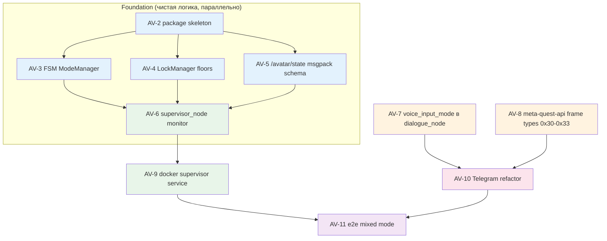

# Avatar Feature — Epic Decomposition (research + worker-issue breakdown)

> **For Claude / Hermes workers:** этот план — источник истины для эпика
> Avatar. Каждый `[AV-N]` — отдельная worker-карточка (issue → branch → PR).
> Читай свой `[AV-N]` блок, не держи в голове остальные фазы.

| Поле | Значение |
|---|---|
| Epic | Avatar (Quest + Telegram supervisor) |
| Branch epic | `feature/avatar` (от `develop`, commit `955cbf58`) |
| Milestone | M4: Avatar (Quest + Telegram) |
| Автор плана | architect, kanban t_c035d460 |
| Дата | 2026-08-24 |
| Источники | ADR-0027, ADR-0028, plan `2026-08-24-meta-quest-telepresence.md`, `meta-quest-api.md`, `SYSTEM_OVERVIEW.md` §5.2/§5.4 |

---

## 1. Контекст и бизнес-проблема

В рамках фичи **Avatar** (робот как аватар оператора) уже спроектировано
(ADR-0027, ADR-0028), но **кода ещё нет**. План `2026-08-24-meta-quest-telepresence.md`
разбивает Quest MVP на 7 фаз с жёсткой TDD-дисциплиной, но это один большой
план на одного исполнителя. Эпик Avatar в реаленности шире:

- **Meta Quest WebXR-аватар** (ADR-0027) — 7 фаз + Phase 2/3 контур;
- **Avatar Supervisor** (ADR-0028) — 6 фаз + интеграция с `dialogue_node` и `rob_box_telegram`;
- **Telegram как второй клиент** того же аватара.

Задача этого эпик-плана — разложить ВСЁ вышеперечисленное на **маленькие
worker-issue** (≤ 1 рабочий день каждый), каждое со своим branch/PR/unit-тестами,
raw-evidence обязателен (ADR-0018, AGENTS.md). Без этого воркеры не возьмутся —
слишком большой пласт.

**Северная звезда (Шифу, ADR-0027 §1.1):** робот как аватар оператора
(телеприсутствие в учебном заведении). Phase 1 — строго LAN PoC. Phase 2/3 —
out of scope для этой декомпозиции, обозначены отдельным контуром (раздел 9).

---

## 2. Research pass — что подтверждено

### 2.1. Расхождения ADR-0027 ↔ реальный код (все 6 закрыты как `CONFIRMED`)

Источник: `docs/plans/2026-08-24-meta-quest-telepresence.md` строки 26–35
(таблица расхождений). Сверка по `feature/avatar` commit `955cbf58`:

| # | ADR предполагает | Факт в коде (file:line) | Статус | Карточка-исполнитель |
|---|---|---|---|---|
| 1 | `voice_input_mode` уже есть в `dialogue_node` | Параметра нет, `grep` пуст (`src/rob_box_voice/.../dialogue_node.py:646–670`) | CONFIRMED | **AV-7** |
| 2 | dialogue_node публикует `/voice/state` | Реально `/voice/dialogue/state` (`dialogue_node.py:415`) | CONFIRMED | В Phase 1.4 плана Quest (`docs/plans/2026-08-24-meta-quest-telepresence.md` Phase 1.4) — отдельный подпункт; **не выделяем** в самостоятельный issue, фиксируется внутри **AV-8** (wire-протокол supervisor) |
| 3 | Камера = `oak_d/stereo/image_rect_raw` | Реально `/camera/camera/color/image_raw` + `/camera/camera/depth/image_rect_raw`; FPS = 5 (`docker/vision/config/oak-d/oak_d_config.yaml`) | CONFIRMED | Phase 1.4 плана Quest, документируется там; **не** выделяем |
| 4 | LiDAR 3D pointcloud есть | `pubPointCloud2: false` (`docker/main/config/lslidar/lsx10_custom.yaml:25`) | CONFIRMED | Phase 3 (контур), не блокирует |
| 5 | Zenoh keyexpr `ros2_main/oak_d/...` | Префикс `robots/{ROBOT_ID}` (namespace прозрачен) | CONFIRMED | Phase 1.3 плана Quest; документируется там |
| 6 | `ffmpeg -i /dev/video0` для камеры | OAK-D — НЕ V4L2, кадры = `sensor_msgs/Image` | CONFIRMED | Phase 1.4 плана Quest (JPEG baseline); документируется там |

**Итог:** только расхождение #1 выделено в самостоятельный worker-issue (**AV-7**).
Остальные живут внутри фаз плана Quest (Phase 1.3, 1.4) — на это уже есть готовый
план с TDD, нет смысла дублировать декомпозицию.

### 2.2. Открытые вопросы ADR-0028 §6 (6 штук)

| # | Вопрос | Закрытие здесь | Где остаётся |
|---|---|---|---|
| Q1 | dialogue_node упал, voice_floor держит клиент — что делать? | **Частично закрыто**: fail-safe `off` + снять floor. Полная логика рестарта — **AV-6** (supervisor_node monitor-режим) с явным поведением heartbeat. | Phase 2 worker-issue если усложнится |
| Q2 | PIN для client API — общий с Quest или отдельный? | **Закрыто**: единый PIN на сервис (Phase 1 PoC), эволюция — общий ADR по auth в Phase 3 (ADR-0027 §6 Q12). Реализация: **AV-6** (Phase 1 monitor-режим использует тот же PIN, что и `rob_box_quest`). | ADR по auth Phase 3 |
| Q3 | Что видит Telegram-бот когда `avatar_present` активен? | **Закрыто для архитектуры**: супервизор публикует `/avatar/state`, клиент сам решает UX. Конкретный UX Telegram — в **AV-10** (рефакторинг Telegram под client API). | UX-фаза конкретного бота |
| Q4 | Dead-man 500 мс норм? | **Закрыто для Phase 1**: 500 мс приемлемо для Quest (Wi-Fi jitter 50–200 мс). Сбор метрик `dead_man_trips_total{client_id}` — в **AV-6** (Phase 1 monitor выводит счётчик в `/avatar/state`). | Phase 2 если потребуется перенастройка |
| Q5 | Где живёт `/avatar/state` — Vision Pi или Main Pi? | **Закрыто**: Vision Pi (рядом с супервизором). Реализация: **AV-9** (docker-сервис supervisor на Vision Pi). | — |
| Q6 | Нужен ли supervisor для Phase 1 MVP Quest? | **Закрыто**: в Phase 1 — только monitor-режим (наблюдает, не вмешивается). Включение `active` — после закрытия AV-7 + AV-8 + AV-10. ADR-0028 §4.5 зафиксировано. | — |

**Итог:** все 6 открытых вопросов ADR-0028 либо закрыты в этом плане, либо
попадают в конкретный `[AV-N]` (см. ссылку в колонке «закрытие»).

### 2.3. Что НЕ выносим в worker-issues

Сознательно НЕ декомпозируем (Phase 3 контур, ADR-0027 §6 Q9–Q12):
- R6 Spatial audio (Q6) — нужен HRTF research;
- R7 Multi-user / failover / battery (Q2, Q7);
- R10 Стрим-селектор (Phase 2);
- R11 Детекция людей (Phase 2, Q10);
- R12 Ходимое 3D-пространство (Phase 2, Q9);
- R13 LLM-формализация (Phase 3);
- R14 Админ-панель restart/диагностика (Phase 2, Q11);
- Auth-эволюция (Phase 3, Q12).

Это отдельные epic-карточки, **не** часть декомпозиции этого эпика. В
разделе 9 — контурные рекомендации для следующего шага Шифу (если будет
решение открыть M5/M6).

---

## 3. Стратегия декомпозиции

**Принципы (Шифу / AGENTS.md / ADR-0018 / ADR-0021):**

1. **Один PR = одна задача.** WIP-коммиты в ту же ветку, push сразу (см.
   контракт воркера в kanban-t_c035d460 body).
2. **TDD обязателен** для всего, где есть чистая логика (FSM, LockManager,
   msgpack-схема, frame codec). Перед кодом — падающий тест.
3. **Raw-evidence в каждом PR**: `pytest -v` (с полным -v, не «тесты прошли»),
   `black --check --line-length 120`, `flake8`, `gh run view <run_id>`,
   `docker logs` если сервис деплоился.
4. **Phase-блокировка**: не делаем AV-8/AV-10/AV-11 пока не закрыт AV-7
   (без `voice_input_mode` supervisor не может переключать режимы).
5. **`feature/avatar` как интеграционная ветка**: все PR мержатся в неё
   (не в develop!) — это feature-branch от develop. Финальный merge в
   develop — Шифу лично (AGENTS.md).

**Размер issue:** ≤ 1 рабочий день воркера. Если больше — разбить дальше.

**Параллелизм:** AV-2/AV-3/AV-4/AV-5/AV-8 не блокируют друг друга (чистая
логика, разные файлы, разные тесты). AV-6 ждёт AV-2. AV-9 ждёт AV-6.
AV-10 ждёт AV-8. AV-11 ждёт AV-10 + AV-9.

---

## 4. Декомпозиция: 11 worker-issues

Ниже — черновик каждой карточки. Каждая имеет: title, labels, milestone,
body (acceptance criteria + sources of truth + Definition of Done). Полные
тела — в файлах issue-body и будут создаваться скриптом `scripts/agent_flow/create_avatar_issues.sh`
(этот скрипт — артефакт плана, см. раздел 7).

### AV-2 — package skeleton `src/rob_box_supervisor/` (TDD)

| Поле | Значение |
|---|---|
| Branch | `feature/av-2-supervisor-package-skeleton` (от `feature/avatar`) |
| Assignee (label) | `agent:backend` |
| Labels | `source:gsd`, `type:infrastructure`, `priority:medium`, `needs-e2e` (smoke-import) |
| Milestone | M4 |
| Сложность | ½ дня |

**Acceptance:**
- `src/rob_box_supervisor/package.xml`, `setup.py`, `setup.cfg`, `pytest.ini`
  созданы по образцу `src/rob_box_voice/`.
- `rob_box_supervisor/__init__.py` пустой (версия).
- Smoke-test: `test/unit/test_import.py::test_import_module` — `import rob_box_supervisor` → OK.
- `pytest src/rob_box_supervisor/test/unit -q` GREEN.
- `black --check --line-length 120 src/rob_box_supervisor` PASS.
- `flake8 src/rob_box_supervisor` PASS (max-complexity=10).

**Sources:** `src/rob_box_voice/package.xml`, `setup.py`, `setup.cfg`, `pytest.ini`;
`docs/adr/0028-avatar-supervisor.md` §4.6 (структура пакета).

**Commit:**
```
git commit -m "feat(supervisor): package skeleton + smoke-import (TDD)
```

---

### AV-3 — FSM `off → telegram_active → avatar_present → mixed` (чистая логика)

| Поле | Значение |
|---|---|
| Branch | `feature/av-3-supervisor-fsm` (от `feature/avatar`) |
| Assignee | `agent:backend` |
| Labels | `source:gsd`, `type:functional`, `priority:high`, `no-e2e-required` (pure unit) |
| Milestone | M4 |
| Сложность | ½–1 день |

**Acceptance:**
- `src/rob_box_supervisor/rob_box_supervisor/core/fsm.py` — `ModeManager`
  класс. Методы: `transition(event: Event) -> Mode | ConflictError`.
- Таблица переходов — копия ADR-0028 §4.1 mermaid-stateDiagram.
- Тесты: `test/unit/core/test_fsm.py` (≥ 10 кейсов):
  - `off → telegram_active` (telegram_acquire_floor).
  - `off → avatar_present` (quest_acquire_floor).
  - `telegram_active → mixed` (quest_acquire_floor только teleop).
  - `avatar_present → mixed` (telegram_acquire_voice_floor).
  - `mixed → off` (both_release).
  - `telegram_active → off` (timeout 30 с, fake clock).
  - Конфликт: попытка `off → avatar_present` когда telegram держит `voice_floor`
    → `ConflictError(voice_floor=telegram_client_id)`.
  - Любой `* → off` всегда разрешён (escape hatch).
  - Идемпотентность: повторный `acquire` от того же клиента — no-op.
  - Неизвестное событие → `ValueError`.

**Sources:** `docs/adr/0028-avatar-supervisor.md` §4.1; ADR-0028 §6 Q1 (fail-safe).

**Без ROS:** тесты только Python, `fsm.py` импортирует только `enum` и `dataclasses`.

**Commit:**
```
git commit -m "feat(supervisor): FSM ModeManager off/telegram_active/avatar_present/mixed (TDD)"
```

---

### AV-4 — LockManager `teleop_floor` / `voice_floor` (чистая логика)

| Поле | Значение |
|---|---|
| Branch | `feature/av-4-supervisor-lock-manager` |
| Assignee | `agent:backend` |
| Labels | `source:gsd`, `type:functional`, `priority:high`, `no-e2e-required` |
| Milestone | M4 |
| Сложность | ½ дня |

**Acceptance:**
- `src/rob_box_supervisor/rob_box_supervisor/core/locks.py` — `LockManager`
  класс. Методы: `acquire(client_id, floor)`, `release(client_id, floor)`,
  `heartbeat(client_id, floor, now_ms)`, `holder(floor) -> client_id | None`.
- Два независимых floor-а (`teleop_floor`, `voice_floor`).
- Dead-man: `heartbeat` не вызывался > 500 мс → `holder` возвращает `None`,
  внутренне помечает floor как `expired`.
- Тесты: `test/unit/core/test_locks.py` (≥ 8 кейсов):
  - acquire → holder; release → None.
  - acquire(telegram, teleop), acquire(quest, voice) — оба держат (разные floors).
  - acquire(quest, voice), acquire(telegram, voice) → второго `ConflictError`.
  - heartbeat refreshes; no heartbeat 500 мс → auto-release.
  - release by wrong client_id → `PermissionError`.
  - heartbeat by wrong client_id → `PermissionError` (нельзя «продлевать» чужой).

**Sources:** ADR-0028 §4.2; §6 Q4 (dead-man 500 мс).

**Commit:**
```
git commit -m "feat(supervisor): LockManager teleop_floor/voice_floor + 500ms dead-man (TDD)"
```

---

### AV-5 — `/avatar/state` msgpack-схема + тесты сериализации

| Поле | Значение |
|---|---|
| Branch | `feature/av-5-avatar-state-msgpack-schema` |
| Assignee | `agent:backend` |
| Labels | `source:gsd`, `type:functional`, `priority:medium`, `no-e2e-required` |
| Milestone | M4 |
| Сложность | ½ дня |

**Acceptance:**
- `src/rob_box_supervisor/rob_box_supervisor/core/state.py` — dataclasses:
  `AvatarState(mode, teleop_floor, voice_floor, last_event, since_ms, version)`,
  `FloorState(client_id, since_ms, last_heartbeat_ms)`,
  `AvatarEvent(timestamp_ms, client_id, kind, args)`.
- Сериализация: `pack(state) -> bytes` (msgpack), `unpack(bytes) -> AvatarState`
  (round-trip + version check).
- Тесты: `test/unit/core/test_state.py` (≥ 6 кейсов):
  - Round-trip `AvatarState` (все поля заполнены).
  - Round-trip с None floors (off-режим).
  - Forward-compat: payload c `version+1` → `unpack` или raise, или молча
    игнорирует новые поля (выбрать и зафиксировать в коде).
  - Backward-compat: payload от старого клиента без `last_event` → defaults.
  - Размер типичного payload (off-режим) ≤ 200 байт (для 1 Hz публикации).
  - msgpack из `pack` десериализуется внешним `msgpack.unpackb` (контракт).

**Sources:** ADR-0028 §4.3 (AvatarState.msg), `meta-quest-api.md` §3 (BINARY_FRAME 0x10).

**Commit:**
```
git commit -m "feat(supervisor): /avatar/state msgpack schema + serialization round-trip (TDD)"
```

---

### AV-6 — `supervisor_node.py` в monitor-режиме (Phase 1, безопасный деплой)

| Поле | Значение |
|---|---|
| Branch | `feature/av-6-supervisor-node-monitor` |
| Assignee | `agent:backend` |
| Labels | `source:gsd`, `type:functional`, `priority:high`, `needs-e2e` |
| Milestone | M4 |
| Сложность | 1 день |

**Acceptance:**
- `src/rob_box_supervisor/rob_box_supervisor/supervisor_node.py` —
  ROS2-нода (`rclpy`, `zenoh_session` через `ZENOH_SESSION_CONFIG_URI`).
- Параметр `mode` (default `"monitor"`). В monitor-режиме:
  - Публикует `/avatar/state` (latched, `transient_local`) из агрегатора.
  - Принимает сервисы `AcquireFloor`, `ReleaseFloor`, `SetAvatarMode`,
    пишет в лог, отвечает `success=true, applied=false, reason="supervisor_in_monitor_mode"`.
  - НЕ меняет `twist_mux` inputs, НЕ правит `dialogue_node` параметры.
- Агрегатор `/avatar/state` собирает из `/odom`, `/device/snapshot`,
  `/voice/dialogue/state` (НЕ `/voice/state` — расхождение #2, см. ADR-0027).
- `dead_man_trips_total{client_id}` счётчик публикуется в `/avatar/state`
  (как часть `last_event` payload, ADR-0028 §6 Q4).
- Unit-тесты с mock `rclpy` и fake aggregator: heartbeat трип → лог,
  `/avatar/state` обновляется.

**Sources:** ADR-0028 §4.5 (monitor-режим); ADR-0028 §4.3 (API);
`docs/architecture/SYSTEM_OVERVIEW.md` §5.4; `dialogue_node.py:415` (топик).

**Commit:**
```
git commit -m "feat(supervisor): supervisor_node.py in monitor mode (Phase 1 safe deploy)"
```

---

### AV-7 — закрыть расхождение #1: `voice_input_mode` в `dialogue_node._declare_params()`

| Поле | Значение |
|---|---|
| Branch | `feature/av-7-voice-input-mode-param` (от `feature/avatar`) |
| Assignee | `agent:backend` |
| Labels | `source:gsd`, `type:functional`, `priority:high`, `no-e2e-required` (pure param addition) |
| Milestone | M4 |
| Сложность | ¼ дня |

**Acceptance:**
- В `src/rob_box_voice/rob_box_voice/dialogue_node.py:646` (метод `_declare_params`)
  добавлен параметр:
  ```python
  self.declare_parameter("voice_input_mode", "respeaker")  # respeaker | quest_passthrough | quest_ttts | quest_stt | quest_llm_formalize
  ```
- `src/rob_box_voice/config/dialogue_node.yaml` обновлён: добавлен ключ
  `voice_input_mode: respeaker` (default).
- В коде диалога (где разветвляется вход аудио) добавлен stub-обработчик
  нового параметра (без реальной логики Phase 2 — только declare + log при
  изменении через `add_on_set_parameters_callback`).
- Регрессионный unit-тест: `test/unit/test_voice_input_mode_param.py`
  (читает YAML, проверяет наличие ключа, default = "respeaker").
- Существующие тесты voice-пайплайна остаются GREEN.

**Sources:** ADR-0027 §3.4 (4 режима + default), план Quest строки 487
(`voice_input_mode` в `dialogue_node._declare_params()`).

**Commit:**
```
git commit -m "feat(voice): declare voice_input_mode param in dialogue_node (ADR-0027 §3.4)"
```

---

### AV-8 — расширить `meta-quest-api.md` frame-типами `0x30–0x33`

| Поле | Значение |
|---|---|
| Branch | `feature/av-8-meta-quest-frame-types-supervisor` |
| Assignee | `agent:architect` (docs-only) |
| Labels | `source:gsd`, `type:functional`, `priority:high`, `no-e2e-required` |
| Milestone | M4 |
| Сложность | ¼ дня |

**Acceptance:**
- В `docs/architecture/meta-quest-api.md` §3 добавлены 4 frame-типа
  (из ADR-0028 §4.4):
  - `0x30 SET_MODE` — client → supervisor, msgpack `{client_id, mode}`.
  - `0x31 ACQUIRE_FLOOR` — client → supervisor, `{client_id, floor: teleop|voice}`.
  - `0x32 RELEASE_FLOOR` — client → supervisor, аналогично.
  - `0x33 STATE_UPDATE` — supervisor → client, msgpack `{state: <packed AvatarState>}`.
- В §5 добавлен `JSON_CMD` клиентский wrapper для тех же 4 команд
  (для HTTP/REST клиентов и для обратной совместимости через JSON).
- В §11 (versioning) добавлен bump `subprotocol = robbox-quest-v2`
  (несовместимое расширение — server должен проверять и отвечать
  `ERROR{PROTOCOL_VERSION}` для v1 клиентов, либо поддерживать обе версии;
  решение фиксируется в комментарии, реализация — в Phase 2 AV-10).
- В §8 добавлены error codes: `FLOOR_HELD` (другой клиент держит floor),
  `MODE_CONFLICT` (FSM отклонила переход).

**Sources:** ADR-0028 §4.4 (клиентский API), §6 Q2 (PIN общий).

**Commit:**
```
git commit -m "docs(meta-quest-api): extend frame types 0x30-0x33 for supervisor client API"
```

---

### AV-9 — docker-сервис `rob_box_supervisor` (Phase 1 monitor)

| Поле | Значение |
|---|---|
| Branch | `feature/av-9-supervisor-docker-service` |
| Assignee | `agent:devops` |
| Labels | `source:gsd`, `type:infrastructure`, `priority:medium`, `needs-e2e` |
| Milestone | M4 |
| Сложность | ½ дня |

**Acceptance:**
- `docker/vision/supervisor/Dockerfile` создан по образцу
  `docker/vision/voice_assistant/Dockerfile` (app-layer на базе
  `ghcr.io/krikz/rob_box:ros2-zenoh-humble-*`).
- � НЕ `COPY config/`, ❌ НЕ `COPY scripts/` (см. `docs/development/DOCKER_STANDARDS.md`).
- `docker/vision/supervisor/start_supervisor.sh` — запуск
  `ros_with_namespace.sh rob_box_supervisor supervisor_node`.
- `docker/vision/docker-compose.yaml` — сервис `supervisor` добавлен
  по образцу `voice-assistant`:
  - `network_mode: host`.
  - `ZENOH_SESSION_CONFIG_URI=/tmp/zenoh_session_config.json5`.
  - `RMW_IMPLEMENTATION=rmw_zenoh_cpp`.
  - `volumes: ['./config:/config:ro', './scripts:/ros_scripts:ro']`.
  - `depends_on: zenoh-router-vision (healthy)`.
- `docker build` без ошибок (raw-evidence в PR).
- `docker compose up -d supervisor` → `docker logs supervisor` показывает
  `mode: monitor`, `/avatar/state` публикуется (raw-evidence: последние
  30 строк лога в PR-описании).

**Sources:** ADR-0028 §4.6 (деплой), `DOCKER_STANDARDS.md`, план Quest Phase 1.6.

**Commit:**
```
git commit -m "infra(supervisor): docker service on Vision Pi (Phase 1 monitor)"
```

---

### AV-10 — рефакторинг `rob_box_telegram` на клиентский API супервизора

| Поле | Значение |
|---|---|
| Branch | `feature/av-10-telegram-supervisor-client` |
| Assignee | `agent:backend` |
| Labels | `source:gsd`, `type:refactor`, `priority:medium`, `needs-e2e` |
| Milestone | M4 |
| Сложность | 1 день |

**Acceptance:**
- `src/rob_box_telegram/.../telegram_node.py:65` — публикация `cmd_vel_web`
  ЗАМЕНЯЕТСЯ на service-call `AcquireFloor{client_id="telegram", floor="teleop"}`
  перед каждой командой движения; если `success=false` — UI Telegram
  гасит кнопки движения (UX по ADR-0028 §6 Q3).
- `src/rob_box_telegram/.../telegram_node.py:66` — публикация TTS
  оборачивается в `AcquireFloor{client_id="telegram", floor="voice"}` +
  после `ReleaseFloor`.
- Heartbeat `teleop_heartbeat` (10 Гц) шлётся, пока держится `teleop_floor`.
- Подписка на `/avatar/state` (latched) — кнопки движения в Telegram
  дизейблятся, если `state.teleop_floor != "telegram"`.
- Существующие тесты Telegram-команд остаются GREEN (адаптация под mock
  service-call).
- Новый тест: `test/unit/test_telegram_supervisor_client.py` — verify
  acquire → publish → release sequence (mock rclpy services).

**Sources:** ADR-0028 §1.2 (что болит), §4.4 (client API), §6 Q3 (UX Telegram).
Зависит от **AV-8** (frame-типы задокументированы) и **AV-6** (supervisor
принимает сервисы в monitor-режиме).

**Commit:**
```
git commit -m "refactor(telegram): route move/tts commands through supervisor client API"
```

---

### AV-11 — e2e: Quest teleop + Telegram voice одновременно (mixed-режим)

| Поле | Значение |
|---|---|
| Branch | `feature/av-11-avatar-mixed-e2e` |
| Assignee | `agent:e2e-runner` |
| Labels | `source:gsd`, `type:testing`, `priority:high`, `needs-e2e` |
| Milestone | M4 |
| Сложность | 1 день |

**Acceptance:**
- Тестовый сценарий (запускается на Vision Pi + Main Pi, см.
  `docs/development/E2E_GUIDE.md`):
  1. Поднять `rob_box_quest` + `rob_box_supervisor` (active mode) + `rob_box_telegram`.
  2. Открыть WebXR-клиент в браузере dev-машины, авторизоваться PIN.
  3. Зажать grip на контроллере, дать twist `linear=0.3` → бот едет.
  4. Из Telegram одновременно послать `/say привет` → бот произносит
     через TTS голосом робота (НЕ из ReSpeaker).
  5. Скриншот/лог: `docker logs supervisor` показывает
     `mode=mixed, teleop_floor=quest, voice_floor=telegram`.
  6. Разорвать Wi-Fi на dev-машине (или закрыть вкладку) → через ≤ 500 мс
     робот safe-stop, Telegram получает STATE_UPDATE
     `{floors.teleop: none}`, кнопки движения в Telegram разблокированы.
  7. Из Telegram послать `/forward` → робот едет, `/avatar/state` →
     `mode=telegram_active, teleop_floor=telegram`.
- Raw-evidence в PR: `pytest -v`, `docker logs` (последние 50 строк
  supervisor/quest/telegram), скриншоты mixed-state.
- `agent-flow-merge-gate` проверяет raw-evidence блок.

**Sources:** ADR-0028 §4.6 acceptance; план Quest §7.

**Зависит от:** AV-9 (docker), AV-10 (Telegram refactor), AV-6 (active mode включён).

**Commit:** без кода — результаты в issue-комментарий / PR-описание (raw-evidence).

---

## 5. Dependency graph (mermaid)



**Критический путь:** AV-2 → AV-3/AV-4 → AV-6 → AV-9 → AV-11 (5 issue, ~3.5–4 дня).

**Можно параллельно:** AV-5 (независимый), AV-7 (независимый), AV-8 (независимый).

---

## 6. Definition of Done (эпик-декомпозиции)

- [ ] 11 issue-черновиков (AV-2 ... AV-12 — но AV-12 зарезервирован за
      «Vision v2 research», см. раздел 9; в этом эпике 11) созданы в
      `krikz/rob_box_project` под milestone M4 с labels `source:gsd`,
      `agent:<profile>`, `type:functional/infrastructure/testing`,
      `priority:high/medium` (см. таблицы в разделе 4).
- [ ] Каждый issue содержит ссылки на источники истины (ADR-0027 / ADR-0028 /
      SYSTEM_OVERVIEW §5.4 / конкретные файлы:строки).
- [ ] Mermaid dependency graph (раздел 5) скопирован в описание эпика
      (`#1595` или новый epic-issue).
- [ ] AV-2 и AV-3 сразу взяты в работу (`gh issue develop` → ветка → PR).
- [ ] План-файл `docs/plans/2026-08-24-avatar-decomposition.md` закоммичен в
      `feature/avatar` (этот PR).
- [ ] PR прошёл `agent-flow-merge-gate` (raw-evidence проверен).

---

## 7. Артефакты плана

В этом PR создаются / обновляются:

1. **`docs/plans/2026-08-24-avatar-decomposition.md`** — этот файл (источник истины).
2. **`scripts/agent_flow/create_avatar_issues.sh`** — bash-скрипт, который
   создаёт 11 issue в `krikz/rob_box_project` через `gh api`. Параметры:
   `--dry-run`, `--milestone 4`, `--assignees av2:backend,av3:backend,...`.
   Скрипт **не** запускается автоматически — это артефакт для Шифу
   (или следующего шага архитектора) на случай если Шифу захочет пересоздать
   набор issue после правок (idempotency: `--idempotency-key` через
   `gh issue create --label` совпадение title).
3. **Комментарий в issue #1595** — ссылка на этот план + mermaid graph +
   список созданных AV-N issue (после прогона скрипта).

---

## 8. Что НЕ делаем в этой декомпозиции (anti-scope)

Чтобы не разрастаться:

- ❌ Не пишем код — только план + issue-черновики. Любой AV-N — отдельная worker-карточка.
- ❌ Не реализуем Phase 3 (R6/R7/R12/R13) — это отдельный epic.
- ❌ Не меняем `dialogue_node` глубже, чем declare_parameter для
  `voice_input_mode` (AV-7) — реальная логика режимов в Phase 2 worker-issue
  следующего эпика.
- ❌ Не дублируем фазы 1.1–1.7 плана Quest — они уже декомпозированы
  в `docs/plans/2026-08-24-meta-quest-telepresence.md` (файл уже есть).
- ❌ Не пишем ADR-0029 (или любой новый ADR) — план ссылается на
  существующие ADR-0027/0028 и фиксирует только решения по 6 открытым
  вопросам ADR-0028 §6 (см. раздел 2.2).

---

## 9. Phase 3 контур (для следующего эпика / M5)

Только обозначение, **НЕ** часть декомпозиции:

- **R10 Стрим-селектор** (ADR-0027 §3.1): расширить `meta-quest-api.md`
  на multi-subscribe, registry стримов в supervisor.
- **R11 Детекция людей**: топик `person_detections` (0x1301), источник
  (Q10: OAK-D depthai / отдельный YOLO / rtabmap).
- **R12 Ходимое 3D-пространство** (Q9): grid-map + pointcloud + depth →
  исследование (нужен ли SLAM-меш / сплаттинг).
- **R13 LLM-формализация**: 4-й режим `llm_formalize` в `dialogue_node`
  (Phase 3, R13).
- **R14 Админ-панель**: `admin_logs`/`admin_logs_stop` в supervisor API.
- **Auth-эволюция** (Q12): TOTP → mTLS, туннель (Tailscale/Cloudflare).
- **Multi-user** (Q2): arbitration, per-client nonce.

Если Шифу даст добро — отдельная карточка «AV-12: Phase 3 vision-v2 research
decomposition» (создание этого issue **не** входит в текущий эпик).

---

## 10. Ссылки

- [ADR-0027](../adr/0027-meta-quest-ar-control.md) — Meta Quest / WebXR-аватар
- [ADR-0028](../adr/0028-avatar-supervisor.md) — Avatar Supervisor state-machine
- [docs/plans/2026-08-24-meta-quest-telepresence.md](2026-08-24-meta-quest-telepresence.md) — план Quest (Phase 1.1–1.7), reference для фазовых контекстов
- [docs/architecture/meta-quest-api.md](../architecture/meta-quest-api.md) — wire-протокол (расширяется в AV-8)
- [docs/architecture/SYSTEM_OVERVIEW.md §5.4](../architecture/SYSTEM_OVERVIEW.md) — Avatar Supervisor секция
- [AGENTS.md](../../AGENTS.md) — культура честности, raw-evidence
- [ADR-0018](../adr/0018-agent-honesty-culture.md) — «честный FAIL лучше красивого PASS»
- [ADR-0013](../adr/0013-incremental-delivery-over-big-bang.md) — incremental delivery правила
- [Issue #1576](https://github.com/krikz/rob_box_project/issues/1576) — оригинальный Meta Quest feature request
- [Issue #1595](https://github.com/krikz/rob_box_project/issues/1595) — этот эпик (decomposition)
