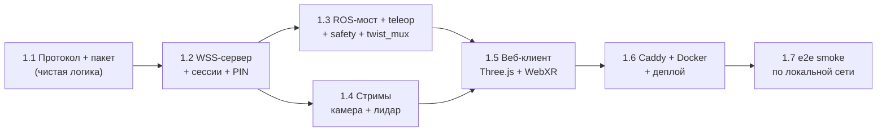

# Meta Quest / WebXR телеприсутствие (rob_box_quest) — Implementation Plan

> **For Claude:** REQUIRED SUB-SKILL: Use superpowers:executing-plans to implement this plan task-by-task.

**Goal:** PoC удалённого присутствия: HTTPS-сервис `rob_box_quest` на Vision Pi отдаёт веб-клиент (обычный браузер + Meta Quest WebXR), который стримит камеру и лидар робота и телеопает его, с dead-man безопасностью. Северная звезда — телеприсутствие в учебном заведении, но Phase 1 строго локальная сеть.

**Architecture:** Один новый ROS2-пакет `src/rob_box_quest/` (Python, ament_python): aiohttp WSS-сервер (единый сокет `wss://…:8443/quest`, multiplexed) + ROS/Zenoh-мост (подписка на `/camera/camera/color/image_raw`, `/scan`, `/voice/dialogue/state`; публикация `cmd_vel_quest`). Статический веб-клиент (Three.js + WebXR Device API) собирается esbuild'ом и отдаётся через Caddy (self-signed TLS). Teleop идёт через `twist_mux` (новый input `quest`, приоритет ниже joystick, dead-man).

**Tech Stack:** Python 3.10, ROS 2 Humble (rclpy, `rmw_zenoh_cpp`), aiohttp (WSS), msgpack + struct (бинарные фреймы), Three.js + esbuild (клиент), Caddy 2 (HTTPS), Docker.

**Design:** `docs/adr/0027-meta-quest-ar-control.md` (решения и trade-offs) + `docs/architecture/meta-quest-api.md` (полный wire-протокол: frame format, topic_id map, JSON_CMD/JSON_EVENT, error codes). **Читать их в первую очередь** — этот план ссылается на них, а не дублирует.

---

## Как читать этот план (правила контекста)

1. **Фаза = новое контекстное окно.** Исполнитель берёт ОДНУ фазу за раз: читает её блок `Context` (точные файлы/строки), реализует, проходит DoD, коммитит. Не держать в голове весь план.
2. **Не бродить по проекту.** Каждая фаза перечисляет `sources_of_truth` с точными путями. Открывать только их, остальное — точечно.
3. **Raw-evidence обязателен** (ADR-0018, `AGENTS.md`): в коммите/PR — вывод `pytest -v`, `black --check`, `flake8`, `docker build`. Не «тесты прошли», а вывод.
4. **Разведку отдавать сабагенту.** «Где обрабатывается X» → sub-agent, в сессию воркера только «файл:строка».
5. **Commit после каждой фазы**, НЕ push без явной просьбы. НИКОГДА `Co-authored-by`.
6. Docker-правила (`docs/development/DOCKER_STANDARDS.md`): ❌ `COPY config/` и `COPY scripts/` в Dockerfile; ✅ `network_mode: host`; ✅ volumes `./config:/config:ro`.

---

## ⚠️ Расхождения ADR-0027 ↔ реальный код (учтены в плане)

| # | ADR предполагает | Факт в коде | Что делаем |
|---|---|---|---|
| 1 | `voice_input_mode` уже есть в `dialogue_node` | Параметра **нет** | Добавить в `dialogue_node._declare_params()` (`src/rob_box_voice/rob_box_voice/dialogue_node.py:646`) |
| 2 | dialogue_node публикует `/voice/state` | Реально публикуется `/voice/dialogue/state` (`dialogue_node.py:415`) | Phase 2: подписываться на `/voice/dialogue/state` |
| 3 | Камера = `oak_d/stereo/image_rect_raw` | Реально `/camera/camera/color/image_raw` + `/camera/camera/depth/image_rect_raw`; FPS = 5 (`docker/vision/config/oak-d/oak_d_config.yaml`) | Подписываться на реальные топики; для teleop поднять `i_fps` до 15–30 (Phase 1.4) |
| 4 | LiDAR 3D pointcloud есть | `pubPointCloud2: false` (`docker/main/config/lslidar/lsx10_custom.yaml:25`) | Phase 1 — только `/scan` (2D). 3D — из rtabmap `/rtabmap/cloud_map` (Phase 3) |
| 5 | Zenoh keyexpr `ros2_main/oak_d/...` | Префикс `robots/{ROBOT_ID}` (namespace прозрачен для ROS-имён) | Подписываться на обычные ROS-имена (`/camera/...`, `/scan`) через тот же session |
| 6 | `ffmpeg -i /dev/video0` для камеры | OAK-D — НЕ V4L2-устройство; кадры приходят как `sensor_msgs/Image` | Кодировать `sensor_msgs/Image` → JPEG (cv_bridge) как baseline, H.264 — отдельным шагом если latency > бюджета |

---

## Фазы и зависимости



- **Phase 1** (1.1–1.7) — MVP, цель этого плана.
- **Phase 2** (follow-up, контур): голосовые режимы (`voice_input_mode`), детекция людей, стрим-селектор, админ-панель/логи.
- **Phase 3** (follow-up, контур): ходимое 3D-пространство, spatial audio, multi-user, эволюция доступа (mTLS/TOTP + туннель).

---

# Phase 1 — MVP (локальная сеть)

Definition of Done Phase 1: с dev-машины в браузере открывается `https://quest.rob_box.local` (DNS на роутере), виден стрим камеры и лидар-оверлей, стик двигает робота, отпускание grip останавливает робота, при обрыве Wi-Fi робот safe-stop.

---

## Phase 1.1 — Пакет + wire-протокол (чистая логика, TDD)

**Context / sources of truth:**
- Протокол: `docs/architecture/meta-quest-api.md` §2 (frame format), §3 (frame types), §4 (topic_id map).
- Образец python-пакета: `src/rob_box_voice/package.xml`, `src/rob_box_voice/setup.py`, `src/rob_box_voice/setup.cfg`.
- Тесты: `src/rob_box_voice/test/unit/` — чистые модули без rclpy; `src/rob_box_voice/pytest.ini` (`testpaths = test/unit`).
- Python: `d:\PROJECTS\rob_box_project\.venv\Scripts\python.exe`.

**Files:**
- Create: `src/rob_box_quest/package.xml`
- Create: `src/rob_box_quest/setup.py`
- Create: `src/rob_box_quest/setup.cfg`
- Create: `src/rob_box_quest/pytest.ini`
- Create: `src/rob_box_quest/rob_box_quest/__init__.py`
- Create: `src/rob_box_quest/rob_box_quest/protocol/__init__.py`
- Create: `src/rob_box_quest/rob_box_quest/protocol/frame.py`
- Create: `src/rob_box_quest/rob_box_quest/protocol/topics.py`
- Test: `src/rob_box_quest/test/unit/protocol/test_frame.py`
- Test: `src/rob_box_quest/test/unit/protocol/test_topics.py`

**Task 1.1.1 — `package.xml` / `setup.py` / `setup.cfg` / `pytest.ini`**

Скопировать структуру `rob_box_voice`, но минимально: deps `rclpy`, `sensor_msgs`, `std_msgs`, `geometry_msgs`; exec_depend `python3-aiohttp`, `python3-msgpack`. `setup.py` entry_point:
`quest_node = rob_box_quest.quest_node:main`. `data_files` — пока пусто (launch/config появятся в 1.6).

**Task 1.1.2 — `frame.py`: кодирование/декодирование фрейма**

Протокол (из `meta-quest-api.md` §2):
```
[1 byte: type][4 bytes: stream_id (LE uint32)][varint: payload_len (LEB128)][payload]
```

Шаг 1 — падающий тест:

```python
"""Unit-тесты wire-протокола rob_box_quest (frame encode/decode)."""
import pytest

from rob_box_quest.protocol.frame import (
    FrameType,
    decode_frame,
    encode_frame,
    encode_leb128,
    decode_leb128,
)


class TestLEB128:
    @pytest.mark.parametrize(
        "value,expected",
        [
            (0, b"\x00"),
            (127, b"\x7f"),
            (128, b"\x80\x01"),
            (300, b"\xac\x02"),
            (2 ** 32, b"\x80\x80\x80\x80\x10"),
        ],
    )
    def test_roundtrip(self, value, expected):
        assert encode_leb128(value) == expected
        assert decode_leb128(encode_leb128(value)) == value

    def test_reject_negative(self):
        with pytest.raises(ValueError):
            encode_leb128(-1)


class TestFrame:
    def test_roundtrip_json_payload(self):
        payload = b'{"cmd": "teleop_twist"}'
        raw = encode_frame(FrameType.JSON_CMD, stream_id=7, payload=payload)
        ftype, sid, got = decode_frame(raw)
        assert ftype == FrameType.JSON_CMD
        assert sid == 7
        assert got == payload

    def test_roundtrip_empty_payload(self):
        raw = encode_frame(FrameType.GOODBYE, stream_id=0, payload=b"")
        ftype, sid, got = decode_frame(raw)
        assert ftype == FrameType.GOODBYE
        assert got == b""

    def test_decode_incomplete_header_raises(self):
        with pytest.raises(ValueError):
            decode_frame(b"\x01\x02\x03")

    def test_decode_truncated_payload_raises(self):
        raw = encode_frame(FrameType.BINARY_FRAME, stream_id=0x1001, payload=b"abcdef")
        with pytest.raises(ValueError):
            decode_frame(raw[:-2])
```

Шаг 2 — запустить, убедиться что падает:
`cd d:\PROJECTS\rob_box_project && .venv\Scripts\python.exe -m pytest src/rob_box_quest/test/unit/protocol/test_frame.py -q`
Expected: FAIL — `ModuleNotFoundError: No module named 'rob_box_quest.protocol.frame'`.

Шаг 3 — минимальная реализация `frame.py`:

```python
"""Wire-протокол rob_box_quest: frame encode/decode.

Формат (meta-quest-api.md §2):
  [1 byte: type][4 bytes: stream_id LE][LEB128: payload_len][payload]
"""
from __future__ import annotations

import struct
from enum import IntEnum


class FrameType(IntEnum):
    HELLO = 0x01
    WELCOME = 0x02
    SUBSCRIBE = 0x03
    UNSUBSCRIBE = 0x04
    BINARY_FRAME = 0x10
    JSON_CMD = 0x11
    JSON_EVENT = 0x12
    GOODBYE = 0x20
    ERROR = 0xFF


HEADER_STRUCT = struct.Struct("<BI")  # type + stream_id


def encode_leb128(value: int) -> bytes:
    if value < 0:
        raise ValueError("LEB128 supports unsigned only")
    out = bytearray()
    while True:
        byte = value & 0x7F
        value >>= 7
        if value:
            out.append(byte | 0x80)
        else:
            out.append(byte)
            break
    return bytes(out)


def decode_leb128(data: bytes, offset: int = 0) -> tuple[int, int]:
    result = 0
    shift = 0
    while True:
        if offset >= len(data):
            raise ValueError("truncated LEB128")
        byte = data[offset]
        offset += 1
        result |= (byte & 0x7F) << shift
        if not byte & 0x80:
            return result, offset
        shift += 7
        if shift > 70:
            raise ValueError("LEB128 too long")


def encode_frame(ftype: FrameType, stream_id: int, payload: bytes) -> bytes:
    header = HEADER_STRUCT.pack(int(ftype), stream_id)
    return header + encode_leb128(len(payload)) + payload


def decode_frame(raw: bytes) -> tuple[FrameType, int, bytes]:
    if len(raw) < HEADER_STRUCT.size:
        raise ValueError("incomplete header")
    ftype, stream_id = HEADER_STRUCT.unpack_from(raw)
    plen, off = decode_leb128(raw, HEADER_STRUCT.size)
    payload = raw[off : off + plen]
    if len(payload) != plen:
        raise ValueError("truncated payload")
    return FrameType(ftype), stream_id, payload
```

Шаг 4 — запустить, убедиться что зелёные: та же команда. Expected: PASS (10 passed).

**Task 1.1.3 — `topics.py`: registry топиков + payload-кодеки**

Функции: `TOPIC_IDS` (UI-имя → `topic_id` из `meta-quest-api.md` §4), `encode_lidar_2d(scan)` (struct: заголовок float32 + ranges + intensities), `encode_robot_status(...)` (msgpack), `encode_person_detections(...)` (msgpack, Phase 2 — но контракт задаём сейчас). Точный wire-формат `lidar_2d` — `meta-quest-api.md` §4 строка `0x1101`.

Шаг 1 — падающий тест (`test_topics.py`): проверить что `TOPIC_IDS["camera_rear"] == 0x1001`, что `encode_lidar_2d` даёт корректный размер `8*4 + n*4*2`, что `encode_robot_status` даёт msgpack-dict с ключами `battery_pct, wifi_rssi, mode, vel_linear, vel_angular, ts_ms`, что `encode_person_detections` содержит ключ `detections`.

Шаг 2 — FAIL. Шаг 3 — реализация (зависимости: `msgpack`, `struct`). Шаг 4 — PASS.

**DoD Phase 1.1:** `pytest src/rob_box_quest/test/unit -q` — GREEN; `black --check --line-length 120 src/rob_box_quest`; `flake8 src/rob_box_quest`.

**Commit:**
```bash
git add src/rob_box_quest/
git commit -m "feat(quest): package skeleton + WSS frame codec + topic registry (TDD)"
```

---

## Phase 1.2 — WSS-сервер + сессии + PIN (aiohttp)

**Context / sources of truth:**
- Handshake/PIN: `docs/architecture/meta-quest-api.md` §1, §3 (HELLO/WELCOME), §7 (heartbeat), §8 (error codes).
- Единственный HTTP-стек в репо: `src/rob_box_voice/rob_box_voice/action_server/http_server.py` (+ `http.py`) — aiohttp, `/healthz`.
- Авторизация: ADR-0027 §4.5 (6-значный PIN, логируется при старте).

**Files:**
- Create: `src/rob_box_quest/rob_box_quest/server/__init__.py`
- Create: `src/rob_box_quest/rob_box_quest/server/session.py` — `ClientSession` (state, subscribed topics, last_seen, ping).
- Create: `src/rob_box_quest/rob_box_quest/server/ws_server.py` — aiohttp WebSocket handler: приём `HELLO` → проверка PIN → `WELCOME`/`ERROR{AUTH_FAIL}`; роут `SUBSCRIBE/UNSUBSCRIBE`; отправка `heartbeat` каждые 200 мс; disconnect → `GOODBYE`.
- Test: `src/rob_box_quest/test/unit/server/test_session.py`
- Test: `src/rob_box_quest/test/unit/server/test_ws_server.py` (aiohttp test client `pytest-aiohttp`, чистый сервер без ROS-ноды — мост подставляется через dependency-injection).

**Steps (кратко, TDD как в 1.1):** тест на PIN (верный → WELCOME, неверный → ERROR AUTH_FAIL и close), тест на subscribe → ack `stream_id`, тест на heartbeat (mock clock), тест на watchdog (нет ping > 600 мс → сервер рвёт сокет). Затем реализация.

**DoD Phase 1.2:** `pytest src/rob_box_quest/test/unit/server -q` GREEN; `black`/`flake8` чисто.

**Commit:**
```bash
git commit -m "feat(quest): aiohttp WSS server with PIN auth, subscribe, heartbeat watchdog"
```

---

## Phase 1.3 — ROS/Zenoh-мост + teleop + dead-man + safety

**Context / sources of truth:**
- `twist_mux` конфиг: `docker/main/config/twist_mux/twist_mux.yaml` (полный ниже).
- Пример ROS-ноды: `src/rob_box_voice/rob_box_voice/dialogue_node.py` (структура `Node`, `_declare_params`).
- Telegram-нода как образец «нода + внешний интерфейс»: `src/rob_box_telegram/rob_box_telegram/telegram_node.py`.
- Команды: `meta-quest-api.md` §5 (`teleop_twist`, `stop_emergency`), §6 (`safety_stop` event), ADR-0027 §3.3 (dead-man, watchdog, emergency B).

**Файлы:**
- Create: `src/rob_box_quest/rob_box_quest/quest_node.py` — ROS2-нода: публикует `cmd_vel_quest` (`geometry_msgs/Twist`), `cmd_vel_emergency` (для input `emergency_stop`), подписывается на `/odom` (status). Держит `TeleopController`.
- Create: `src/rob_box_quest/rob_box_quest/core/__init__.py`
- Create: `src/rob_box_quest/rob_box_quest/core/teleop.py` — чистая логика: `TeleopController.consume(linear, angular, deadman, now) -> Twist | None`; таймаут 500 мс → None (dead-man); `emergency_stop()` → lock до сброса.
- Create: `src/rob_box_quest/rob_box_quest/core/safety.py` — `Watchdog`: если от клиента нет фреймов > 500 мс → `emergency_stop` + close.
- Test: `src/rob_box_quest/test/unit/core/test_teleop.py`
- Test: `src/rob_box_quest/test/unit/core/test_safety.py`
- Modify: `docker/main/config/twist_mux/twist_mux.yaml` — добавить input `quest`.

**`twist_mux.yaml` сейчас (полностью):**

```yaml
twist_mux:
  ros__parameters:
    topics:
      emergency_stop:
        topic: cmd_vel_emergency
        timeout: 0.1
        priority: 255
      joystick:
        topic: cmd_vel_joy
        timeout: 0.5
        priority: 100
      web_ui:
        topic: cmd_vel_web
        timeout: 1.0
        priority: 50
      voice:
        topic: cmd_vel_voice
        timeout: 1.0
        priority: 25
      navigation:
        topic: cmd_vel
        timeout: 0.5
        priority: 10
    locks:
      joystick_lock:
        topic: /joystick_lock
        timeout: 0.0
        priority: 100
```

**Правка:** вставить `quest` между `joystick` и `web_ui` (физический пульт всегда побеждает):

```yaml
      quest:
        topic: cmd_vel_quest
        timeout: 0.5
        priority: 40
```

**Task 1.3.1 — `teleop.py` (TDD).** Тесты: `consume` с `deadman=True` → Twist с линейной/угловой; `deadman=False` → None; таймаут (now - last > 0.5 с) → None; `emergency_stop()` → все последующие `consume` None до `reset()`.

**Task 1.3.2 — `safety.py` Watchdog (TDD).** Тест: `feed(now)` сбрасывает счётчик; без `feed` > 500 мс → `tripped=True`; `reset()`.

**Task 1.3.3 — `quest_node.py`.** Подписка на WSS-команды (через очередь от ws_server), маршрутизация `teleop_twist` → `TeleopController` → publish `cmd_vel_quest` (throttle 30 Гц, см. `meta-quest-api.md` §9); `stop_emergency` → publish `cmd_vel_emergency` (edge). `robot_status` агрегируется (батарея/Wi-Fi — Phase 2 источник; в Phase 1 отдавать mode + `vel` из `/odom`).

**Task 1.3.4 — twist_mux.yaml.** Добавить input `quest` (см. выше). Проверка валидности — запуск twist_mux на роботе (см. 1.7).

**DoD Phase 1.3:** unit-тесты GREEN; `twist_mux.yaml` содержит input `quest` с priority 40 и timeout 0.5.

**Commit:**
```bash
git add src/rob_box_quest/rob_box_quest/core src/rob_box_quest/rob_box_quest/quest_node.py src/rob_box_quest/test/unit/core docker/main/config/twist_mux/twist_mux.yaml
git commit -m "feat(quest): ROS bridge node + teleop dead-man + safety watchdog + twist_mux quest input"
```

---

## Phase 1.4 — Стримы: камера и лидар

**Context / sources of truth:**
- Топики: `/camera/camera/color/image_raw` (`sensor_msgs/Image`), `/scan` (`sensor_msgs/LaserScan`), FPS-конфиг `docker/vision/config/oak-d/oak_d_config.yaml` (`i_fps: 5.0` сейчас).
- Форматы: `meta-quest-api.md` §4 (`camera_rear` = H.264 Annex-B; `lidar_2d` = float32 struct).
- ⚠️ Расхождение 6: OAK-D не V4L2. Baseline Phase 1 — JPEG кадры через cv_bridge.

**Files:**
- Create: `src/rob_box_quest/rob_box_quest/streams/__init__.py`
- Create: `src/rob_box_quest/rob_box_quest/streams/camera.py` — подписка на `color/image_raw`, `cv_bridge` → `cv2.imencode('.jpg')` → `BINARY_FRAME(topic camera_rear)`. Настройка качества/частоты (переподписка throttle).
- Create: `src/rob_box_quest/rob_box_quest/streams/lidar.py` — подписка на `/scan` → `encode_lidar_2d` (из 1.1) → `BINARY_FRAME(topic lidar_2d)`.
- Create: `src/rob_box_quest/rob_box_quest/streams/status.py` — агрегатор `robot_status` (1 Гц).
- Modify: `docker/vision/config/oak-d/oak_d_config.yaml` — `i_fps` 5.0 → 15.0 (для teleop), либо оставить и задокументировать (решение в коммите).
- Test: `src/rob_box_quest/test/unit/streams/test_lidar_payload.py` (чистая функция: `LaserScan` → bytes → размер), `test_camera_payload.py` (encode JPEG — если cv2 доступен в venv; иначе пометить `@pytest.mark.skip`).

**Task 1.4.1 — `lidar.py` payload (TDD, чистый).** `scan_to_payload(msg) -> bytes` через `struct.pack` заголовка + ranges + intensities; тест на размер и roundtrip.

**Task 1.4.2 — `camera.py`.** `image_to_payload(msg) -> bytes` (JPEG, `cv2.imencode`), тест с синтетическим `sensor_msgs/Image` (numpy zeros) если `cv2` есть.

**Task 1.4.3 — подписки + routing в ws_server.** `SUBSCRIBE(camera_rear|... )` → регистрация потока → `BINARY_FRAME` в сокет клиента; backpressure `drop-oldest` (ADR §4).

**Решение по H.264:** Phase 1 — JPEG (просто, работает без /dev/video). Замерить latency (§8). Если > 200 мс — отдельная карточка на ffmpeg `libx264`/hardware-encoder (Phase 2, tech-debt из ADR §4.3).

**DoD Phase 1.4:** стримы камеры и лидара доходят до ws-клиента (см. 1.7); unit-тесты payload GREEN.

**Commit:**
```bash
git commit -m "feat(quest): camera (JPEG) + lidar (2D) binary streams over WSS"
```

---

## Phase 1.5 — Веб-клиент (Three.js + WebXR)

**Context / sources of truth:**
- Стек: ADR-0027 §4.2 (Three.js + native WebXR Device API, esbuild; НЕ Babylon/A-Frame).
- Команды/события: `meta-quest-api.md` §5/§6.
- Сборка: esbuild, output в `docker/vision/quest_static/` (ADR §4.2).

**Files:**
- Create: `src/rob_box_quest/webxr_client/package.json` (three, esbuild; devDeps typescript)
- Create: `src/rob_box_quest/webxr_client/src/main.ts` — точка входа: WSS-клиент, HELLO/PIN, SUBSCRIBE.
- Create: `src/rob_box_quest/webxr_client/src/wire.ts` — клиентская обёртка frame-протокола (зеркало `frame.py`).
- Create: `src/rob_box_quest/webxr_client/src/render/camera.ts` — декод JPEG (`URL.createObjectURL` + ``/`<video>`); H.264-путь оставить заглушкой.
- Create: `src/rob_box_quest/webxr_client/src/render/lidar.ts` — `THREE.Points` из `lidar_2d`, цвет по дистанции.
- Create: `src/rob_box_quest/webxr_client/src/render/teleop.ts` — WebXR controller: thumbstick → `teleop_twist` (30 Гц), grip = dead-man (`deadman:true`), кнопка B → `stop_emergency`.
- Create: `src/rob_box_quest/webxr_client/src/ui/hud.ts` — статус, PIN-ввод, переключение режимов (Phase 2), «CONNECTION LOST» (heartbeat).
- Create: `src/rob_box_quest/webxr_client/src/render/person.ts` — (заглушка Phase 2, рендер детекций).

**Steps (пошагово, не TDD-юнит — клиент проверяется в 1.7):**
1. `wire.ts`: `connect(url, pin)`, `sendJson(cmd)`, `onBinary(topic_id, cb)`.
2. `main.ts`: handshake → SUBSCRIBE(`camera_rear`, `lidar_2d`, `robot_status`).
3. `camera.ts`: рендер JPEG-фреймов в полноэкранную текстуру (обычный браузер) и в AR-слой (WebXR).
4. `lidar.ts`: point-cloud на полу сцены.
5. `teleop.ts`: thumbstick → twist; grip → dead-man; статус «dead-man RELEASED» красным.
6. WebXR: `XRSession` immersive-vr/ar, passthrough (если поддерживается), requestHitTestSource опционально.
7. Сборка: `npm run build` → `docker/vision/quest_static/index.html` + `bundle.js`.

**DoD Phase 1.5:** `npm run build` завершается без ошибок; в браузере (не-Quest) открывается страница с PIN-формой и логами соединения.

**Commit:**
```bash
git commit -m "feat(quest): WebXR web client (Three.js) — camera, lidar, teleop, dead-man"
```

---

## Phase 1.6 — Caddy + TLS + Docker-сервис + деплой

**Context / sources of truth:**
- HTTPS-стек: ADR-0027 §4.1 (Caddy self-signed, Caddyfile). В репо Caddy/openssl НЕТ — всё новое.
- Docker-эталон сервиса: `docker/vision/docker-compose.yaml:207` (блок `voice-assistant`) и `:315` (`voice-action-server`, единственный HTTP-сервис).
- Dockerfile-эталон: `docker/vision/voice_assistant/Dockerfile` (app-layer). Base — лёгкий `docker/base/Dockerfile.ros2-zenoh`.
- Docker-стандарты: `docs/development/DOCKER_STANDARDS.md`.

**Files:**
- Create: `docker/vision/quest/Dockerfile` — multi-stage: `node:20` (esbuild build webxr_client) + `ghcr.io/krikz/rob_box:ros2-zenoh-humble-*` (rclpy + aiohttp + msgpack). ❌ НЕ `COPY config/` и НЕ `COPY scripts/`.
- Create: `docker/vision/quest/Caddyfile`:
  ```
  quest.rob_box.local, 10.1.1.11 {
      tls /certs/selfsigned.crt /certs/selfsigned.key {
          protocol tls1.3
      }
      root * /srv/quest_static
      reverse_proxy localhost:8765
  }
  ```
- Create: `docker/vision/scripts/quest/start_quest.sh` — генерит self-signed cert (`openssl req -x509 ...`), поднимает `rob_box_quest` (python) + Caddy.
- Create: `docker/vision/scripts/quest/start_quest_service.sh` — запуск ROS-ноды через `ros_with_namespace.sh`.
- Modify: `docker/vision/docker-compose.yaml` — сервис `quest` (по образцу `voice-assistant`): `network_mode: host`, `ZENOH_SESSION_CONFIG_URI=/tmp/zenoh_session_config.json5`, `RMW_IMPLEMENTATION=rmw_zenoh_cpp`, volumes `./config:/config:ro`, `./scripts:/ros_scripts:ro`, `./scripts/quest:/scripts:ro`, `depends_on: zenoh-router (healthy)`.

**Steps:**
1. Dockerfile (multi-stage, node build → статик в caddy; app-layer с rob_box_quest).
2. `start_quest.sh` (certs + запуск).
3. Compose-сервис `quest` (port 8443 внутри host-network).
4. `docker compose build quest` и `docker compose up -d quest` на Vision Pi (через GitHub Actions deploy, НЕ scp).
5. Проверка: `docker logs quest` → сгенерирован PIN; `curl -k https://10.1.1.11:8443/healthz`.

**DoD Phase 1.6:** `docker build` без ошибок; healthcheck `/healthz` отвечает; статик отдаётся.

**Commit:**
```bash
git add docker/vision/quest docker/vision/scripts/quest docker/vision/docker-compose.yaml
git commit -m "feat(quest): Caddy self-signed TLS + docker service on Vision Pi"
```

---

## Phase 1.7 — e2e smoke по локальной сети (ручная верификация)

**Что проверяем (на роботе, dev-машине и роутере):**
1. DNS на роутере: `quest.rob_box.local → 10.1.1.11`; с dev-машины `ping quest.rob_box.local`.
2. Импорт сертификата в Quest (Settings → Privacy → Security → Trusted Sources) — однократно.
3. С браузера dev-машины: открыть `https://quest.rob_box.local`, ввести PIN (из `docker logs quest`).
4. Виден стрим камеры (замерить latency: фото таймера → экран), лидар-оверлей.
5. Teleop: стик двигает робота; отпустить grip → робот останавливается ≤ 100 мс.
6. Обрыв Wi-Fi (отключить Wi-Fi на Quest/dev-машине) → робот safe-stop ≤ 500 мс, UI «CONNECTION LOST».
7. Raw-evidence: `docker logs quest` (последние 50 строк), скриншоты, замеры latency.

**DoD Phase 1.7 (и всей Phase 1):** пункты 1–6 выполнены с raw-доказательствами. Только после этого закрывать MVP.

**Commit:** нет кода — результаты в issue-комментарий / PR-описание (raw-evidence).

---

# Phase 2 — follow-up (контур, отдельные карточки)

Каждый пункт — отдельная worker-карточка (issue + branch), НЕ в этом PR.

1. **Голосовые режимы** (`meta-quest-api.md` §5 `voice_mode`, ADR §3.4): добавить `voice_input_mode` в `dialogue_node._declare_params()` (`dialogue_node.py:646`), значения `respeaker/quest_passthrough/quest_ttts/quest_stt/quest_llm_formalize`; топик `/audio/quest_in`; режим `llm_formalize` = STT → LLM-перефразирование → TTS. Подписываться на `/voice/dialogue/state` (не `/voice/state` — расхождение 2).
2. **Детекция людей** (R11): топик `person_detections` (`0x1301`, msgpack), источник — OAK-D/depthai или отдельный YOLO (Q10), подсветка в `person.ts`.
3. **Стрим-селектор** (R10): `stream_list` cmd + событие, выбор нескольких `camera_*`.
4. **Админ-панель** (R14): `admin_logs`/`admin_logs_stop` (docker logs/jornald), read-only на PoC (Q11).
5. **Latency/H.264** (tech-debt): заменить JPEG на H.264 если budget > 200 мс (ADR §4.3).

# Phase 3 — follow-up (контур)

1. **Ходимое 3D-пространство** (R12, Q9): grid-map + pointcloud как 3D-сцена; research — хватает ли данных (`/rtabmap/grid_map`, `/rtabmap/cloud_map`, depth) или нужен SLAM-меш/сплаттинг.
2. **Spatial audio** (R6, Q6).
3. **Multi-user + эволюция доступа** (Q12): PIN → TOTP → mTLS, настоящий DNS/TLS, туннель (Tailscale/Cloudflare Tunnel).

---

## Общие quality gates (каждая фаза)

- [ ] `d:\PROJECTS\rob_box_project\.venv\Scripts\python.exe -m pytest src/rob_box_quest/test/unit -q` — GREEN
- [ ] `black --check --line-length 120 <изменённые файлы>` — чисто
- [ ] `flake8 <изменённые файлы>` — чисто
- [ ] `colcon build --packages-select rob_box_quest` (или `docker build`) — без ошибок
- [ ] Dockerfile: нет `COPY config/`, нет `COPY scripts/`
- [ ] raw-вывод приложен в коммит/PR (не «тесты прошли»)

## Итог Phase 1 — сводный список новых/изменённых файлов

Новые:
- `src/rob_box_quest/` (пакет: `protocol/`, `server/`, `core/`, `streams/`, `quest_node.py`, `webxr_client/`, `test/`)
- `docker/vision/quest/` (Dockerfile, Caddyfile)
- `docker/vision/scripts/quest/` (start-скрипты)
- `docker/vision/quest_static/` (билд клиента, артефакт)

Изменённые:
- `docker/main/config/twist_mux/twist_mux.yaml` (input `quest`)
- `docker/vision/docker-compose.yaml` (сервис `quest`)
- `docker/vision/config/oak-d/oak_d_config.yaml` (`i_fps`, если решим поднять)

---

## Handoff

После каждой фазы — коммит + (по желанию) issue-комментарий с raw-evidence. Перед закрытием сессии фазы — приложение: что сделано (commit), что осталось, решения, отвергнутое, как проверить (по шаблону `context-hygiene` §6).
