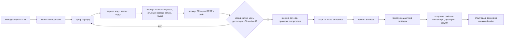

# Координатор Claude + воркеры: разработка с отладкой прямо на роботе

Как товарищ Шифу и координатор (сессия Claude Code) ведут разработку
(DJ/аранжировщик, ADR-0149…0156) в режиме «дежурства»: координатор
раздаёт задачи субагентам-воркерам, каждый воркер пишет код и сам
проверяет его на живом роботе, координатор принимает, мёржит, собирает
и деплоит. Шифу в это время может быть не у компьютера: он слушает
записи и пишет координатору через Telegram-бот робота.

Документ описывает процесс. Правила честности — в `AGENTS.md`
(«Честный FAIL лучше красивого PASS»), они здесь не повторяются.

## 1. Роли

| Кто | Что делает | Чего не делает |
|---|---|---|
| **Шифу** | Ставит цели («доделать ADR диджея»), слушает записи, принимает решения (вопросы ADR, нормы, вкус), может давать право мёржа/деплоя | — |
| **Координатор** (основная сессия Claude Code) | Ведёт очередь задач по ADR и находкам, пишет брифы, выбирает модель воркера, проверяет отчёты, мёржит в `develop`, запускает сборку и деплой, закрывает issue с доказательствами, отвечает Шифу, ведёт хендофф | Сам код фич не пишет; не мёржит в `main` |
| **Воркер** (субагент `Agent`, `isolation: worktree`) | Одна задача: код + тесты + гарды + проверка на роботе + запись + PR + отчёт с raw | Не мёржит; не деплоит; не трогает чужие ветки |

Модель воркера — по сложности: лёгкие и механические задачи (тесты, CI,
скрипты, демонстрационные прогоны) — Sonnet; аранжировщик, гармония,
дизайн, разбор — Opus. Бюджет экономим.

## 2. Цикл одной задачи

1. **Карточка.** Источник: план ADR, живая находка (лог робота, отзыв
   Шифу на слух), аудит или приёмка. В issue кладутся факты: строки
   лога, цифры, номер записи.
2. **Бриф воркеру.** Он самодостаточный: что прочитать (ADR, PR-образцы,
   issue), первый шаг (`git fetch origin && git reset --hard origin/develop
   && git branch -m <тип>/<issue>-<имя>`; не `claude/*`, иначе тег образа
   `local`), задача, метрика успеха, правила стенда, точные фразы для
   инъекции, формат PR и отчёта.
3. **Воркер** пишет код и тесты, прогоняет гарды CI локально
   (`cc_budget`, `class_budget`, `seam_without_consumer`, flake8),
   проверяет на роботе (§4), отправляет запись Шифу и создаёт PR через
   REST (`gh api repos/<owner>/<repo>/pulls --method POST …`, у GraphQL
   кончается лимит). Отчёт содержит raw, цифры «было/стало» и раздел
   «что не проверено».
4. **Приёмка координатором.** Если цель не достигнута или есть регресс,
   PR возвращается тому же воркеру через `SendMessage` (контекст
   сохраняется). CI зелёный, но ветка отстала — `update-branch`, ждать CI
   на новом коммите. Мёрж squash через REST с `sha` головы; **проверить
   `merged=true`, и только потом закрывать issue**, комментарием с PR,
   sha, цифрами и тем, что не проверено. Закрытие по `Closes #N` при
   мёрже в `develop` срабатывает не всегда — проверять состояние issue.
5. **Сборка и деплой** — ручные workflow (`L: Build All Services`, затем
   `L: Deploy and Verify`, параметры — `docs/deployment`). Деплой
   запускается **только на свободном стенде** (§4). После деплоя
   тяжёлые контейнеры снова гасятся (деплой их поднимает), проверяется
   `supercollider` и health `voice-assistant`.

Очередь последовательная там, где задачи трогают одни файлы (гармония,
`compose`, `knowledge`): следующий воркер стартует от develop с
предыдущим фиксом. Независимые задачи (CI, скрипты, офлайн-данные)
идут параллельно.

## 3. Аудит и приёмка — «сам проверяй, что на выходе»

Шифу не обязан слушать каждый трек. Координатор проверяет выход сам:

- **Офлайн по нотам:** `scripts/music/research/arranger_theory_audit.py`
  (`notes` — тоны аккорда на сильной доле, b9, параллели, тритоны баса,
  фаза затакта; `chords` — качество аккордов автора на корпусе). Цифры
  до/после — критерий приёмки фикса.
- **По записи:** `scripts/music/live_dj/s7_metrics.py` и профили эталонов
  стилей (низ/середина/верх, crest, LR, свинг, темп) — тем же методом,
  что эталоны Шифу.
- **Узнаваемость темы:** мотив партитуры сверяется с RTTTL-эталоном того
  же произведения.

Цифры не заменяют слух: в отчётах пишется «на слух не проверено», а
окончательное слово — Шифу по OGG.

## 4. Правила стенда (робот общий)

- Тяжёлые контейнеры (`oak-d`, `rob-box-quest`, `vision-face`,
  `vision-hailo`) потушены на время любых музыкальных прогонов.
- Одна ssh-сессия, без фоновых циклов опроса на роботе.
- Замок `flock /tmp/music_test.lock` держится на весь прогон.
- Свободный стенд: нет `/ws/HOTPATCH` в `voice-assistant`, замок
  свободен, нет идущего сета за 3 мин, нет реплик Шифу роботу.
- Отладка без сборки: `scripts/robot_dev/hotpatch.sh push` → проверка →
  `revert` (статус обязан вернуться к «чистый образ»).
- Реплика роботу — инъекцией в `/voice/stt/result` изнутри
  `voice-assistant` (`ros2 topic pub --once …`), целиком, с «Робот,».
  Ответы робота дублируются в Telegram Шифу: в тексте инъекции не может
  быть команд и секретов.
- После рестарта контейнера ждать «MCP Server запущен» (~35 с).
- Сет, который играет Шифу, не прерывать.
- Деплой не запускать около ночной чистки registry на build-машине
  (cron, см. `docker/build/scripts/setup.sh`).

Доступ к build-машине (katana) для прогонов на корпусе PDMX, NRT-замеров
и публикации ресурсных паков — у координатора; субагентам доступ туда
закрыт. Долгие задачи там запускаются через `setsid nohup`.

## 5. Связь с Шифу через Telegram

**От Шифу к координатору.** Шифу пишет в Telegram-бот робота сообщение,
начинающееся с «Клод …». Робот такие сообщения не обрабатывает
(`core/coordinator_address.py`, #3518). В логе `voice-assistant`
остаётся строка `🎤 STT: [TG:<chat>] Клод …`. Координатор держит
`Monitor` на `docker logs -f voice-assistant | grep '(К|к)лод'`:
- он живёт до 30 мин, поэтому перевзводится при каждом истечении;
- `ssh` переподключается в цикле, потому что деплой пересоздаёт
  контейнер;
- `--since` берётся с перекрытием, чтобы не терять сообщения на стыке;
- уже отвеченные фразы отфильтровываются;
- при локальном grep в Git Bash пишется `(К|к)`, а не `[Кк]`: байтовая
  локаль.

Реплики Шифу без «Клод» адресованы роботу. Их полезно читать: там
находки.

**От координатора к Шифу.**
- **Текст.** `sendMessage` через контейнер `telegram-bot` (в нём есть
  токен): текст копируется на робот, затем выполняется
  `docker exec -i telegram-bot python3 -` с `requests.post(…/sendMessage)`.
  Признак успеха — код 200.
- **Записи.** `scripts/music/live_dj/tgogg.sh`: wav на хосте робота →
  ffmpeg opus → `sendVoice`. Каждую удачную запись присылать сразу, с
  подписью: стиль, тема, источник, что изменилось.

**Стиль сообщений.** Обращение «товарищ Шифу». Коротко и честно: что
сделано, что в работе, что ждёт решения. Указывать номера PR и записей.
Если что-то не проверено, так и писать.

## 6. Хендофф

Сессия может оборваться (лимит, обрыв связи). Координатор ведёт
хендофф-файл и указатель в своей памяти. В хендоффе записано: что
влито и задеплоено (PR, run_id), что в работе (PR, ветка, что осталось),
какие решения ждут Шифу, очередь, ловушки сессии. Новая сессия
начинает с хендоффа, а не с переписки.

## См. также

- `AGENTS.md` — культура честности, ADR-0148 «код решает, LLM говорит».
- `scripts/robot_dev/hotpatch.sh` — горячая заливка.
- `docs/music/arranger_theory_audit_2026-10-07.md`,
  `docs/music/acceptance_styles_2026-10-08.md` — образцы аудита и
  приёмки.
- `src/rob_box_music/test/conftest.py` — бюджет времени тестов в CI.
