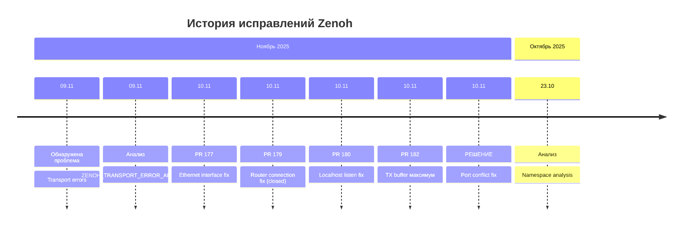

# Zenoh Fixes Index - Rob Box Project

Этот индекс содержит все документы, связанные с исправлениями Zenoh коммуникации в проекте Rob Box.

---

## 🎯 Текущая проблема и решение (2025-11-10)

### ✅ ZENOH_PORT_CONFLICT_FIX_2025-11-10.md

**Проблема:** Конфликт портов между Main Pi и Vision Pi router, вызывающий transport errors и ROS service failures  
**Решение:** Использование конкретных IP адресов (`10.1.1.10:7447`, `10.1.1.11:7447`) вместо wildcard endpoints  
**Статус:** ✅ ИСПРАВЛЕНО - готово к развёртыванию

**Файлы:**
- **📄 [ZENOH_PORT_CONFLICT_FIX_2025-11-10.md](ZENOH_PORT_CONFLICT_FIX_2025-11-10.md)** - Полная техническая документация с mermaid диаграммами
- **📄 [ZENOH_PORT_CONFLICT_QUICKFIX.md](ZENOH_PORT_CONFLICT_QUICKFIX.md)** - Краткое руководство для быстрого развёртывания

---

## 📚 История исправлений Zenoh

### Серия исправлений 2025-11-10

#### 1. PR #177 - Ethernet Interface Fix

**Проблема:** Zenoh трафик шёл через WiFi (100-300 Мбит/с) вместо Gigabit Ethernet (1000 Мбит/с)  
**Решение:** Добавлен параметр `#iface=eth0` для принудительной маршрутизации через Ethernet  
**Статус:** ⚠️ Частично эффективно - помогло, но wildcard endpoints всё ещё вызывали проблемы

**Файлы (архив):**
- **📄 [ZENOH_ETHERNET_INTERFACE_FIX_2025-11-10.md](zenoh_old_fixes/ZENOH_ETHERNET_INTERFACE_FIX_2025-11-10.md)** - Детальная документация (305 строк)
- **📄 [ZENOH_ETHERNET_QUICKFIX.md](zenoh_old_fixes/ZENOH_ETHERNET_QUICKFIX.md)** - Краткий справочник (73 строки)

**Изменённые конфигурации:**
```json5
// Vision Pi
connect.endpoints: ["tcp/10.1.1.10:7447#iface=eth0"]
listen.endpoints: ["tcp/[::]:7447#iface=eth0"]

// Main Pi
listen.endpoints: ["tcp/[::]:7447#iface=eth0"]
```

#### 2. PR #179 - Router Connection Fix (CLOSED, не применялся)

**Проблема:** ROS middleware не мог подключиться к Zenoh router после изменений в PR #177  
**Решение:** Убраны connect endpoints у роутеров - локальные роутеры без внешних подключений  
**Статус:** ❌ Закрыт без слияния - альтернативный подход в PR #180

**Файлы (архив):**
- **📄 [ZENOH_FIX_2025-11-10_DEPLOYMENT.md](zenoh_old_fixes/ZENOH_FIX_2025-11-10_DEPLOYMENT.md)** - Deployment guide
- **📄 [ZENOH_FIX_2025-11-10_MAXIMUM.md](zenoh_old_fixes/ZENOH_FIX_2025-11-10_MAXIMUM.md)** - Максимальные исправления

#### 3. PR #180 - Localhost Listen Fix

**Проблема:** Router с `#iface=eth0` не принимал подключения от локальных ROS нод через localhost  
**Решение:** Добавлен `tcp/localhost:7447` в listen endpoints вместе с `tcp/[::]:7447#iface=eth0`  
**Статус:** ⚠️ Частично эффективно - устранило проблему подключения, но не конфликт портов

**Файлы (архив):**
- **📄 [ZENOH_FIX_QUICKSTART.md](zenoh_old_fixes/ZENOH_FIX_QUICKSTART.md)** - Quick start guide

**Изменённые конфигурации:**
```json5
listen.endpoints: [
  "tcp/localhost:7447",           // Локальные ROS ноды
  "tcp/[::]:7447#iface=eth0"      // Удалённые подключения
]
```

#### 4. PR #182 - TX Buffer Увеличение (МАКСИМУМ)

**Проблема:** "Unable to push non droppable network message" из-за переполнения TX очередей  
**Решение:** Увеличены TX queue sizes до максимума (16 batches), wait_before_close до 60 секунд  
**Статус:** ⚠️ Частично эффективно - улучшило стабильность, но не устранило корневую причину

**Файлы (архив):**
- **📄 [ZENOH_TRANSPORT_FIX_QUICKREF.md](zenoh_old_fixes/ZENOH_TRANSPORT_FIX_QUICKREF.md)** - Quick reference

**Изменённые параметры:**
```json5
transport.link.tx.queue.size: {
  control: 16,      // Было: 8 → Макс: 16
  real_time: 16,    // Было: 8 → Макс: 16
  data_high: 12,    // Было: 6 → Увеличено: 12
}

congestion_control.block.wait_before_close: 60000000  // 60 секунд (было: 30s)
```

---

## 🔬 Анализ и исследования

### Детальный анализ проблемы

**📄 [ZENOH_TRANSPORT_ERROR_ANALYSIS_2025-11-09.md](ZENOH_TRANSPORT_ERROR_ANALYSIS_2025-11-09.md)**  
Глубокий анализ ошибок Zenoh transport, включая:
- Анализ логов и паттернов ошибок
- Исследование механизмов TX очередей
- Эксперименты с различными настройками
- Выводы и рекомендации

### Zenoh Best Practices

**📄 [ZENOH_CONFIGURATION_BEST_PRACTICES.md](ZENOH_CONFIGURATION_BEST_PRACTICES.md)**  
Лучшие практики конфигурации Zenoh для ROS 2:
- QoS настройки
- TX/RX buffer sizing
- Timeout конфигурации
- Network optimization

### Community Research

**📄 [ZENOH_COMMUNITY_RESEARCH_2025-11-10.md](ZENOH_COMMUNITY_RESEARCH_2025-11-10.md)**  
Исследование Zenoh community solutions:
- Поиск решений в GitHub Issues
- Документация Eclipse Zenoh
- ROS 2 Zenoh rmw implementation
- Articulated Robotics видео рекомендации

### Version Research

**📄 [ZENOH_VERSION_RESEARCH_2025-11-09.md](ZENOH_VERSION_RESEARCH_2025-11-09.md)**  
Исследование версий Zenoh:
- Zenoh 0.11.x vs 1.0.x compatibility
- ROS 2 Humble rmw_zenoh_cpp версии
- Migration paths

### Namespace Analysis

**📄 [ZENOH_NAMESPACE_ANALYSIS_2025-10-23.md](ZENOH_NAMESPACE_ANALYSIS_2025-10-23.md)**  
Анализ Zenoh namespacing и topic isolation:
- ROS 2 topic to Zenoh key expression mapping
- Namespace conflicts
- Topic isolation strategies

---

## 📊 Таймлайн проблемы



---

## 🔗 Связанные документы

### Архитектура
- [SYSTEM_OVERVIEW.md](../architecture/SYSTEM_OVERVIEW.md) - Общая архитектура системы
- [SOFTWARE.md](../architecture/SOFTWARE.md) - Программный стек

### Development
- [AGENT_GUIDE.md](../development/AGENT_GUIDE.md) - Руководство для AI агентов
- [DOCKER_STANDARDS.md](../development/DOCKER_STANDARDS.md) - Стандарты Docker

### Другие исправления
- [2025-10-28-fix-apt-proxy-fallback.md](2025-10-28-fix-apt-proxy-fallback.md) - APT proxy issues
- [DOCKER_BUILD_FIX_2025-10-18.md](DOCKER_BUILD_FIX_2025-10-18.md) - Docker build optimization

---

## ✅ Рекомендации

### Для развёртывания

1. **Сначала используйте QUICKFIX guide** - [ZENOH_PORT_CONFLICT_QUICKFIX.md](ZENOH_PORT_CONFLICT_QUICKFIX.md)
2. **При проблемах смотрите полную документацию** - [ZENOH_PORT_CONFLICT_FIX_2025-11-10.md](ZENOH_PORT_CONFLICT_FIX_2025-11-10.md)
3. **Для понимания best practices** - [ZENOH_CONFIGURATION_BEST_PRACTICES.md](ZENOH_CONFIGURATION_BEST_PRACTICES.md)

### Для отладки

1. Проверьте логи обоих роутеров: `docker logs zenoh-router`
2. Проверьте сетевые соединения: `sudo netstat -tnp | grep zenohd`
3. Проверьте ROS топики: `docker exec <container> ros2 topic list`
4. См. секцию "Диагностика проблем" в полной документации

---

**Последнее обновление:** 2025-11-10  
**Статус:** ✅ Текущая проблема решена  
**Автор:** GitHub Copilot
