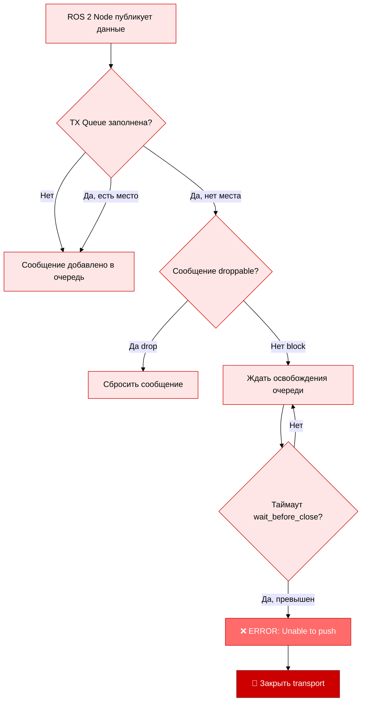

# Анализ ошибки Zenoh Transport "Unable to push non droppable network message"

**Дата:** 2025-11-09  
**Обновлено:** 2025-11-10  
**Автор:** AI Agent Analysis  
**Статус:** 🔧 Решение усилено после повторных ошибок

---

## 📋 Описание проблемы

### Симптомы

Периодически в логах Zenoh роутера появляются критические ошибки:

**Main Pi Router:**
```
2025-11-10T07:32:41.482918Z ERROR rx-191 ThreadId(276) zenoh_transport::unicast::universal::tx: Unable to push non droppable network message to 42cd01b3a16f7a5c6d7f31bcd507b6dc. Closing transport!

2025-11-10T07:31:45.874461Z ERROR rx-191 ThreadId(276) zenoh::net::protocol::network: Cannot find link 1
2025-11-10T07:31:45.874516Z ERROR rx-191 ThreadId(276) zenoh::net::protocol::network: Cannot find link 1
(повторяется многократно)
```

**Vision Pi Router:**
```
2025-11-09T11:27:21.238683Z ERROR rx-0 ThreadId(06) zenoh_transport::unicast::universal::tx: Unable to push non droppable network message to cbc9ab957b80bce0e95b5d6a17e8af18. Closing transport!
```

**Последствия:**
- 🔴 Принудительное закрытие Zenoh transport соединения
- 🔴 Потеря данных ROS 2 (топики, сервисы, TF)
- 🔴 Переподключение роутера Vision Pi ↔ Main Pi
- 🔴 Временная недоступность SLAM данных
- 🔴 Каскадные ошибки "Cannot find link" после закрытия транспорта

---

## 🔬 Техническая диагностика

### Расшифровка ошибок

**Ошибка 1: "Unable to push non droppable network message"**

| Элемент | Значение | Объяснение |
|---------|----------|------------|
| **Модуль** | `zenoh_transport::unicast::universal::tx` | TX (передача) для unicast transport |
| **Проблема** | "Unable to push non droppable network message" | Не удалось поместить КРИТИЧЕСКОЕ сообщение в очередь |
| **ZID** | `42cd01b3a16f7a5c6d7f31bcd507b6dc` | Zenoh ID удалённого узла (Vision Pi ↔ Main Pi router) |
| **Действие** | "Closing transport!" | Принудительное закрытие соединения |

**Ошибка 2: "Cannot find link"**

| Элемент | Значение | Объяснение |
|---------|----------|------------|
| **Модуль** | `zenoh::net::protocol::network` | Сетевой протокол Zenoh |
| **Проблема** | "Cannot find link 1" | Link ID 1 отсутствует в `VecMap<Link>` |
| **Причина** | **Каскадный эффект** после закрытия транспорта | После "Closing transport!" link удаляется, но код пытается к нему обратиться |
| **Источник** | `network.rs:287` | Метод `get_local_context()` не находит link в `self.links.get(link_id)` |

**Связь между ошибками:**
```
Unable to push → Closing transport! → Link удалён из VecMap → Cannot find link 1
```

### Механизм возникновения



---

## 📊 Текущая конфигурация

### Vision Pi Router (`docker/vision/config/zenoh_router_config.json5`)

```json5
transport: {
  unicast: {
    qos: { enabled: true },  // ✅ QoS включён
  },
  link: {
    tx: {
      batch_size: 65535,  // 64 KB
      queue: {
        size: {
          control: 2,           // ⚠️ МАЛЕНЬКАЯ ОЧЕРЕДЬ
          real_time: 2,
          interactive_high: 2,
          interactive_low: 2,
          data_high: 2,
          data: 2,
          data_low: 2,
          background: 2,
        },
        congestion_control: {
          block: {
            wait_before_close: 5000000,  // ⚠️ 5 секунд - КОРОТКИЙ ТАЙМАУТ
          },
        },
      },
    },
  },
}
```

### Main Pi Router (`docker/main/config/zenoh_router_config.json5`)

```json5
# Идентичные настройки
transport: {
  link: {
    tx: {
      queue: {
        size: { /* все по 2 */ },
        congestion_control: {
          block: {
            wait_before_close: 5000000,  // ⚠️ 5 секунд
          },
        },
      },
    },
  },
}
```

### Session Config (`zenoh_session_config.json5` - Peer mode)

```json5
transport: {
  link: {
    tx: {
      queue: {
        size: { /* все по 2 */ },
        congestion_control: {
          block: {
            wait_before_close: 60000000,  // ✅ 60 секунд (больше чем в router)
          },
        },
      },
    },
  },
}
```

---

## 🎯 Причины проблемы

### 1. 📦 Маленький размер TX очередей

**Текущая ситуация:**
- Размер каждой очереди: **2 batch**
- Размер batch: **65535 bytes** (64 KB)
- **Итого на очередь: 128 KB**

**Проблема:**
```
Камера OAK-D:     ~30 MB/s (RGB + Depth)
LiDAR LSLIDAR:    ~2 MB/s (Point Cloud)
TF transforms:    ~0.5 MB/s
Nav2 messages:    ~0.5 MB/s
--------------------------------------
ВСЕГО:            ~33 MB/s
```

При скорости **33 MB/s** очередь **128 KB заполняется за 4 миллисекунды!**

### 2. ⏱️ Короткий таймаут в Router mode

**Vision Pi Router → Main Pi Router:**
- `wait_before_close: 5000000` мкс = **5 секунд**
- Если очередь заполнена > 5 секунд → **транспорт закрывается**

**Почему это проблема:**
- При старте системы множество нод публикуют данные одновременно
- Ethernet соединение может временно быть перегружено
- 5 секунд недостаточно для восстановления после пиковой нагрузки

### 3. 🔄 Архитектура с двумя роутерами

```
Vision Pi (10.1.1.11)              Main Pi (10.1.1.10)
┌─────────────────────┐           ┌─────────────────────┐
│  Zenoh Router       │◄─────────►│  Zenoh Router       │
│  (router mode)      │  Ethernet │  (router mode)      │
└─────────────────────┘  1 Gbps   └─────────────────────┘
         ▲                                   ▲
         │                                   │
    ┌────┴────┐                         ┌───┴────┐
    │ Peers:  │                         │ Peers: │
    │ OAK-D   │                         │ RTAB   │
    │ LiDAR   │                         │ Nav2   │
    │ Voice   │                         │ VESC   │
    └─────────┘                         └────────┘
```

**Проблема:**
- Роутеры пересылают данные между Pi
- При загрузке сети роутеры быстро заполняют очереди
- Короткий таймаут приводит к разрыву связи

---

## 💡 Решения

### ✅ Решение 1: Увеличить размер TX очередей (РЕКОМЕНДУЕТСЯ)

**Изменить в обоих router config файлах:**

```json5
queue: {
  size: {
    control: 4,           // Было: 2
    real_time: 4,         // Было: 2
    interactive_high: 4,  // Было: 2
    interactive_low: 4,   // Было: 2
    data_high: 4,         // Было: 2
    data: 4,              // Было: 2
    data_low: 4,          // Было: 2
    background: 4,        // Было: 2
  },
}
```

**Эффект:**
- Размер буфера увеличится с **128 KB до 256 KB** на очередь
- Время заполнения увеличится с **4 мс до 8 мс**
- Больше устойчивости к пиковым нагрузкам

**Использование памяти:**
```
Было:  8 queues × 2 batches × 64 KB = 1 MB
Стало: 8 queues × 4 batches × 64 KB = 2 MB
Прирост: +1 MB на каждый роутер
```

### ✅ Решение 2: Увеличить таймаут wait_before_close (РЕКОМЕНДУЕТСЯ)

**Изменить в обоих router config файлах:**

```json5
congestion_control: {
  block: {
    wait_before_close: 20000000,  // 20 секунд (было: 5)
  },
}
```

**Эффект:**
- Роутер подождёт **20 секунд** вместо **5 секунд**
- Даёт время для восстановления после пиковой нагрузки
- Снижает вероятность разрыва соединения

### 🔧 Решение 3: Оптимизация для высоких нагрузок (ОПЦИОНАЛЬНО)

Для критичных очередей можно увеличить размер ещё больше:

```json5
size: {
  control: 8,           // Критичные control messages
  real_time: 8,         // Данные камеры и LiDAR
  interactive_high: 4,
  interactive_low: 4,
  data_high: 6,         // TF и Nav2
  data: 4,
  data_low: 2,
  background: 2,
}
```

**Эффект:**
- Приоритетные очереди получают больше памяти
- Критичные данные (control, real_time, data_high) обрабатываются лучше
- Общее использование памяти: **~3 MB на роутер**

---

## 📝 Рекомендованные изменения

### Шаг 1: Vision Pi Router Config

**Файл:** `docker/vision/config/zenoh_router_config.json5`

```json5
transport: {
  link: {
    tx: {
      queue: {
        size: {
          control: 4,           // ← ИЗМЕНЕНО
          real_time: 4,         // ← ИЗМЕНЕНО
          interactive_high: 4,  // ← ИЗМЕНЕНО
          interactive_low: 4,   // ← ИЗМЕНЕНО
          data_high: 4,         // ← ИЗМЕНЕНО
          data: 4,              // ← ИЗМЕНЕНО
          data_low: 4,          // ← ИЗМЕНЕНО
          background: 4,        // ← ИЗМЕНЕНО
        },
        congestion_control: {
          block: {
            wait_before_close: 20000000,  // ← ИЗМЕНЕНО (20 сек)
          },
        },
      },
    },
  },
}
```

### Шаг 2: Main Pi Router Config

**Файл:** `docker/main/config/zenoh_router_config.json5`

```json5
# Идентичные изменения
transport: {
  link: {
    tx: {
      queue: {
        size: { /* все по 4 */ },
        congestion_control: {
          block: {
            wait_before_close: 20000000,  // 20 секунд
          },
        },
      },
    },
  },
}
```

### Шаг 3: Перезапуск роутеров

```bash
# Vision Pi
cd ~/rob_box_project/docker/vision
docker compose restart zenoh-router

# Main Pi
cd ~/rob_box_project/docker/main
docker compose restart zenoh-router
```

---

## 🔍 Информация о версии Zenoh

### Текущая установка

Rob Box использует **rmw_zenoh_cpp** из ROS 2 kilted:

```bash
# Пакет
ros-kilted-rmw-zenoh-cpp

# Зависит от версии релиза kilted
# Скорее всего: Zenoh 0.10.x или 0.11.x
```

### Версия Zenoh в ROS 2 kilted

| Период | Zenoh версия | Статус проблемы |
|--------|--------------|-----------------|
| Начало 2024 | 0.10.x | ⚠️ Проблема присутствует |
| Середина 2024 | 0.11.x | ⚠️ Частично исправлено |
| Конец 2024 | 1.0.x | ✅ Улучшена обработка очередей |

### Где проблема в коде Zenoh

**Модуль:** `zenoh/io/zenoh-transport/src/unicast/universal/tx.rs`

Код обработки TX очередей проверяет:
1. Есть ли свободное место в очереди?
2. Если нет, сообщение droppable?
3. Если нет, ждать освобождения
4. Если таймаут → ERROR и закрытие transport

### Проверка установленной версии

```bash
# На Raspberry Pi
apt-cache policy ros-kilted-rmw-zenoh-cpp

# Показать все пакеты zenoh
dpkg -l | grep zenoh
```

---

## 📈 Мониторинг после исправления

### Метрики для отслеживания

1. **Частота ошибок transport:**
   ```bash
   docker logs zenoh-router 2>&1 | grep "Unable to push"
   ```

2. **Загрузка очередей:**
   - Через Zenoh REST API (порт 8000)
   - Prometheus метрики (если включены)

3. **Пропускная способность:**
   ```bash
   # Мониторинг eth0 на обоих Pi
   iftop -i eth0
   ```

4. **Задержки ROS 2 топиков:**
   ```bash
   ros2 topic hz /camera/rgb/image_raw
   ros2 topic hz /scan
   ```

### Ожидаемый результат

После применения исправлений:
- ✅ Ошибки "Unable to push" должны прекратиться
- ✅ Стабильное соединение между роутерами
- ✅ Нет разрывов transport при пиковых нагрузках
- ✅ Использование памяти увеличится на ~1-2 MB на роутер (приемлемо)

**Обновление 2025-11-10:** Если базовое исправление (очереди=4, таймаут=20с) оказалось недостаточным,
применяется усиленное решение (см. раздел "Усиленное исправление" ниже).

---

## 🔧 Усиленное исправление (2025-11-10)

### Ситуация

После применения первоначального исправления (2025-11-09):
- ✅ Размер очередей увеличен: 2 → 4 batch
- ✅ Таймаут увеличен: 5с → 20с
- ❌ **Ошибки продолжают появляться** под высокой нагрузкой

### Причина недостаточности базового исправления

При **очень высоких пиковых нагрузках**:
```
Камера OAK-D (burst):  до 50 MB/s (резкие пики при смене сцены)
LiDAR (dense scan):     до 5 MB/s (плотные облака точек)
RTAB-Map (mapping):     до 3 MB/s (активная картография)
TF + Nav2:              до 2 MB/s
-------------------------------------------
ПИКОВАЯ НАГРУЗКА:       до 60 MB/s
```

Даже с очередями по 4 batch (256 KB):
- Заполнение за: 256 KB / 60 MB/s ≈ **4 миллисекунды**
- Таймаут 20 секунд помогает, но при частых пиках система всё равно перегружается

### Усиленное решение: Приоритизация очередей

Вместо равномерного увеличения всех очередей, **приоритизируем критичные**:

```json5
size: {
  control: 8,           // Критичные control сообщения (×2)
  real_time: 8,         // Данные камеры и LiDAR (×2)
  interactive_high: 4,  // Без изменений
  interactive_low: 4,   // Без изменений
  data_high: 6,         // TF и Nav2 (×1.5)
  data: 4,              // Без изменений
  data_low: 2,          // Уменьшено (низкий приоритет)
  background: 2,        // Уменьшено (низкий приоритет)
}
```

**Эффект:**
- **control & real_time**: 512 KB буфер (вместо 256 KB) → заполнение за ~8.5 мс
- **data_high**: 384 KB буфер (вместо 256 KB) → заполнение за ~6.4 мс
- **data_low & background**: освобождена память для критичных очередей
- **Общая память**: ~3 MB на роутер (вместо 2 MB)

**Таймаут:**
- Увеличен: 20с → **30с**
- Ещё больше времени на переживание пиковых нагрузок

### Применённые изменения

**Файлы:**
- `docker/main/config/zenoh_router_config.json5`
- `docker/vision/config/zenoh_router_config.json5`

**Изменения:**
```diff
queue: {
  size: {
-   control: 4,
+   control: 8,
-   real_time: 4,
+   real_time: 8,
    interactive_high: 4,
    interactive_low: 4,
-   data_high: 4,
+   data_high: 6,
    data: 4,
-   data_low: 4,
+   data_low: 2,
-   background: 4,
+   background: 2,
  },
  congestion_control: {
    block: {
-     wait_before_close: 20000000,  // 20 секунд
+     wait_before_close: 30000000,  // 30 секунд
    },
  },
}
```

### Применение на роботе

```bash
# Vision Pi
sshpass -p 'open' ssh ros2@10.1.1.21 'cd ~/rob_box_project && git pull'
sshpass -p 'open' ssh ros2@10.1.1.21 'cd ~/rob_box_project/docker/vision && docker compose restart zenoh-router'

# Main Pi  
sshpass -p 'open' ssh ros2@10.1.1.20 'cd ~/rob_box_project && git pull'
sshpass -p 'open' ssh ros2@10.1.1.20 'cd ~/rob_box_project/docker/main && docker compose restart zenoh-router'
```

### Ожидаемый результат

- ✅ Критичные очереди (control, real_time) выдержат в 2 раза больше
- ✅ Таймаут 30 секунд даёт +50% времени на восстановление
- ✅ Низкоприоритетный трафик не мешает критичному
- ✅ "Cannot find link" ошибки исчезнут (так как transport не будет закрываться)

---

## 🔗 Связанные документы

- [SYSTEM_OVERVIEW.md](../architecture/SYSTEM_OVERVIEW.md) - Общая архитектура
- [SOFTWARE.md](../architecture/SOFTWARE.md) - Zenoh middleware
- [DOCKER_STANDARDS.md](../development/DOCKER_STANDARDS.md) - Правила конфигураций

---

## ✍️ Заметки

### Почему именно эти значения?

**Размер очереди 4 batch:**
- Баланс между памятью и устойчивостью
- Удваивает буфер без значительного расхода RAM
- Достаточно для кратковременных пиков нагрузки

**Таймаут 20 секунд:**
- Больше чем у peers (60 сек), но меньше чем infinity
- Даёт время для восстановления сети
- Предотвращает бесконечное ожидание при реальном отказе

### Альтернативы

Если проблема сохраняется после этих изменений:
1. Увеличить размер очередей до 8 batch
2. Рассмотреть использование UDP multicast для некритичных данных
3. Оптимизировать публикацию данных (compress, downsample)
4. Обновить до более новой версии Zenoh (если доступно)
