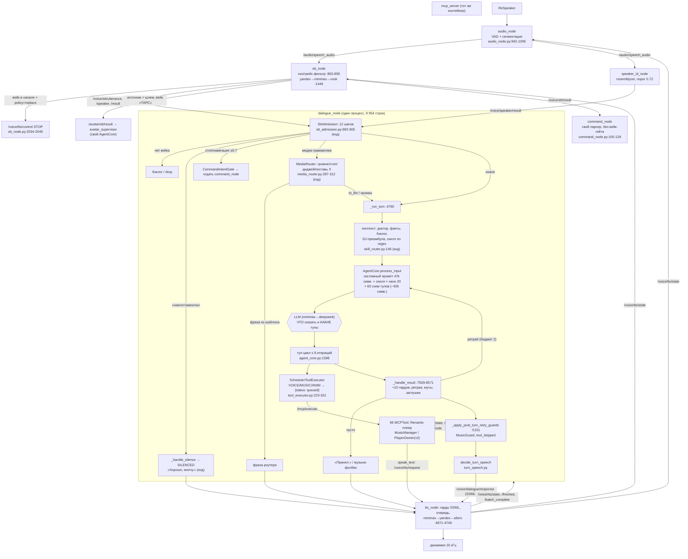

# 02 — Текущая архитектура диалоговой системы (как есть)

| Поле | Значение |
|---|---|
| Дата | 2026-10-01 |
| Коммит | `61fd84ff7` (ветка `claude/dialog-assistant-refactor-5e45ae`, поверх develop) |
| Метод | Статическое чтение кода (grep/AST/radon 6.0.1), сверка с аудитами `docs/research/dialog-v2/raw/architecture-static/` и рантайм-снимком `raw/architecture-runtime/architecture-local-runtime/` (снят `captured_at_unix=1790757036` = 2026-09-30 08:30 UTC, `rmw_zenoh_cpp`, MainPi+VisionPi) |
| Что НЕ делалось | Ничего не запускалось ни локально, ни на роботе. Поведение «в рантайме» — вывод из кода, кроме рёбер, взятых из рантайм-снимка (помечены «рантайм»). |
| Пути | Относительно корня репо. `voice/` = `src/rob_box_voice/rob_box_voice/`, `mcp/` = `src/rob_box_mcp_tools/rob_box_mcp_tools/`, `sup/` = `src/rob_box_supervisor/rob_box_supervisor/`, `tg/` = `src/rob_box_telegram/rob_box_telegram/`, `harness/` = `src/rob_box_harness/rob_box_harness/`. |

Степень проверки: факты собраны пятью параллельными проходами по коду; выборка ключевых утверждений перепроверена вручную (`grep`/`sed -n`) на этом коммите: `DEFAULT_SYNTHETIC_RETRIES: int = 2` (`voice/dialogue_node.py:7861`), `_MAX_TOOL_ITERATIONS: int = 8` (`harness/core/agent_core.py:87`), `skill_tool_narrowing: false` (`docker/vision/config/voice_assistant/dialogue_node.yaml:112`), отсутствие писателя `/voice/current_dialogue_id`, отсутствие подписчика `/dialogue/control_ack`, «Принял.» (`voice/dialogue_node.py:8508`), `NEVER > 0.5` в промпте (`src/rob_box_voice/prompts/master_prompt_compact.txt:637`), `set_dj_mode` всегда `success=True` (`mcp/tools/music.py:7274-7297`), `music_engine: "v1"` (`docker/vision/config/voice_assistant/mcp_server.yaml:12`), неиспользуемые `llm_timeout_sec`/`agent_max_turns` (`voice/dialogue_node.py:1361,1380` — только `declare_parameter`). Остальные `file:line` взяты из проходов и могут сдвинуться на несколько строк.

Отличия от цифр ADR-0148 §1 (там `origin/develop @ 6134dd1fc`):
- `TurnGuards` уже удалён, флага `_use_turn_guards` в коде нет — только упоминание в докстринге `voice/core/turn.py:7-12`.
- `DialogueNode`: 9 954 строк (было 10 559), 210 методов, WMC 1 103 (было 1 204) — radon на этом коммите.
- Ссылок `#NNNN` в `dialogue_node.py` стало больше: 705 (144 уникальных), меток `Bug A–F` — 113–115 (два способа подсчёта).

---

## 1. Процессы, контейнеры, ноды

Все контейнеры диалогового контура описаны в `docker/vision/docker-compose.yaml` (Vision Pi). В `docker/main/docker-compose.yaml` их нет. ROS-контейнеры обёрнуты `docker/vision/scripts/ros_with_namespace.sh:47` (Zenoh-namespace `robots/$ROBOT_ID`).

| Контейнер | compose | Запуск | Что внутри |
|---|---|---|---|
| `voice-assistant` | `:255`, cmd `:418` | `scripts/voice_assistant/start_voice_assistant.sh:177/181` → `ros2 launch .../voice_assistant_headless.launch.py` | 10 ROS-нод одного launch-файла `docker/vision/config/voice_assistant/voice_assistant_headless.launch.py`: `audio_node :59`, `led_node :72`, `voice_animation_player :86`, `dialogue_node :102`, `tts_node :115`, `stt_node :128`, `sound_node :141`, `command_node :154`, `mcp_server :167`, `speaker_id_node :185`. Плюс фоновый `sclang` (`start_voice_assistant.sh:86`). Рантайм-снимок подтверждает этот состав (`runtime-graph.md`, «Container map»). |
| `supervisor` (avatar-supervisor) | `:481`, `AVATAR_SUPERVISOR_MODE=active :505` | `scripts/supervisor/start_supervisor.sh:57` | `avatar_supervisor` (ТАРС, свой `AgentCore`) |
| `avatar-arbiter` | `:561` | `scripts/supervisor/start_arbiter.sh:59` | `avatar_arbiter` (LockManager + FSM режимов) |
| `telegram-bot` | `:672` | `scripts/telegram_bot/start_telegram_bot.sh:49` | `telegram_node` |
| `supercollider` | `:194` | `start_supercollider.sh` | `jackd`, `scsynth` (UDP 57110), без ROS |
| `voice-action-server` | `:448` | `python3 -m rob_box_voice.action_server.http_server` | HTTP-заглушка 127.0.0.1:8765, не ROS action; `_handler` — заглушка (`voice/action_server/http_server.py:10-13,41`), вызовов из `src` нет |
| `rob-box-quest` (внешний пир) | `:611` | `start_quest.sh:129` | `quest_node` (мостик шлема) |

Наблюдения:
- **Один процесс-контейнер держит весь голос.** Падение/рестарт `voice-assistant` роняет STT, TTS, диалог и плеер музыки (Renardo живёт в `mcp_server`) одновременно.
- `start_voice_assistant.sh:166` пишет, что headless-launch запускается «без animation_player_node», но launch его запускает (`:86`, `:203`) — комментарий врёт.
- `src/rob_box_voice/launch/voice_assistant.launch.py` в докере не используется; там `mcp_server` — `ExecuteProcess`, а не `Node` (`:220-222`). Две launch-конфигурации одного стека.
- `startup_greeting_node.py` не имеет entry point — мёртв, заменён таймерами в `dialogue_node` (`src/rob_box_voice/launch/voice_assistant.launch.py:197`).
- `rob_box_music` — чистая библиотека без rclpy и без entry points (`src/rob_box_music/setup.py:10-30`); ROS-интерфейса к голосу у неё нет, её импортирует только `mcp_server`.

### 1.1 Ноды

| Нода | Класс, файл | Строк | Методов | WMC класса | max CC |
|---|---|---:|---:|---:|---|
| dialogue_node | `DialogueNode`, `voice/dialogue_node.py:516` | 9 954 | 210 | **1 103** | 82 `_handle_result` |
| tts_node | `TTSNode`, `voice/tts_node.py:637` | 7 316 | 112 | **694** | 28 `__init__` |
| stt_node | `STTNode`, `voice/stt_node.py:284` | 2 073 | 42 | 220 | 19 `_process_audio` |
| speaker_id_node | `SpeakerIdNode`, `voice/speaker_id_node.py:238` | 2 344 | 38 | 204 | 15 |
| audio_node | `AudioNode`, `voice/audio_node.py:31` | 1 186 | 24 | 129 | 16 `check_vad_and_doa` |
| mcp_server | `MCPServer`, `mcp/mcp_server.py:355` (main `:2039`, MultiThreadedExecutor) | 2 058 | 29 | 168 | 13 |
| avatar_supervisor | `AvatarSupervisor`, `sup/supervisor_node.py:452` | 3 026 | 63 | 318 | 19 `_run_agent_sync` |
| avatar_arbiter | `AvatarArbiter`, `sup/arbiter_node.py:341` | 1 518 | 34 | 96 | 10 |
| telegram_node | `TelegramNode`, `tg/telegram_node.py:87` | 661 | — | — | — |
| command_node, sound_node, led_node | `voice/command_node.py:29`, `voice/sound_node.py:33`, `voice/led_node.py:134` | — | — | — | — |

Метрики посчитаны radon на этом коммите. Лимит ADR-0145: WMC ≤ 80, методов ≤ 40. Статический аудит (`raw/architecture-static/class-metrics.md`) называет 21 god-class, первые два — `DialogueNode` и `TTSNode`.

Модули, на которые разложена логика хода:

| Модуль | Строк | Классов | Замечание |
|---|---:|---:|---|
| `harness/core/agent_core.py` | 2 690 | 4 | `AgentCore`: WMC 176, 29 методов; тул-цикл, окно истории, скиллы |
| `voice/core/dialogue_guards.py` | 3 063 | 2 | 37 вызовов `re.*`, 38 функций-гардов |
| `voice/core/dj_mode.py` | 1 400 | 3 | `DJModeController`: WMC 163 |
| `voice/core/music_guard.py` | 876 | 3 | |
| `voice/core/stt_admission.py` | 952 | 18 | 12 шагов допуска реплики — самый «чистый» участок |
| `voice/core/media_router.py` + `media_command_grammar.py` | 591 + 573 | 7 | детерминированный роутер медиа-команд (ADR-0148-совместим) |
| `voice/scheduler/task_scheduler.py` | 1 312 | 15 | max CC 25 `TaskScheduler.update` |
| `mcp/tools/music.py` | 7 296 | 19 | `ComposeMusicTool` WMC 266, `MusicManager` WMC 228 |
| `mcp/tools/dialogue.py` | 1 735 | 7 | `SpeakTextTool.execute` CC 20 |

---

## 2. Топики, сервисы, actions диалогового контура

Тип сообщения — `std_msgs/String` (почти всегда JSON внутри), если не указано другое. ⚠ — больше одного писателя. «рантайм» — ребро есть в живом графе `runtime-graph.md` (30.09).

### 2.1 Аудио → STT → диалог

| Топик | Писатели | Читатели |
|---|---|---|
| `/audio/speech_audio` (AudioData) | audio_node `voice/audio_node.py:148` | stt_node `voice/stt_node.py:538`; speaker_id `voice/speaker_id_node.py:597` (рантайм) |
| `/audio/vad` (Bool) | audio_node `:149` | dialogue `voice/dialogue_node.py:968` (рантайм) |
| `/audio/audio`, `/audio/state` | audio_node `:147`, `:151` | **нет** (рантайм: dead_output) |
| `/audio/quest_in`, `/audio/quest_wake` (AudioData) | quest_node | stt_node `:545`, `:551` |
| `/voice/stt/result` ⚠ | stt_node `:578`; telegram `tg/telegram_node.py:168` | dialogue `:899`; command_node `voice/command_node.py:47`; perception (рантайм) |
| `/voice/stt/utterance`, `/voice/stt/speaker` | stt_node `:601`, `:593` | dialogue `:938`, `:930` |
| `/voice/stt/state` | stt_node `:586` | **нет** |
| `/avatar/stt/result` | stt_node `:585` | supervisor `sup/supervisor_node.py:640`; quest |
| `/avatar/ptt/result` | stt_node `:584` | supervisor `:672` |
| `/voice/dialogue/barge_in_policy` (latched) | dialogue `:859` | stt_node `:570` |

### 2.2 Диалог → TTS / звук

| Топик | Писатели | Читатели |
|---|---|---|
| `/voice/dialogue/response` ⚠ | dialogue `:824`; telegram `tg/telegram_node.py:169` | tts_node `voice/tts_node.py:1246`; telegram `:193` (читает и свой же топик); perception |
| `/voice/tts/request` ⚠ (5 писателей) | stt_node `:605`; mcp `speak_text` `mcp/tools/dialogue.py:99`; mcp `say` `mcp/tools/say.py:68`; supervisor `:660`; telegram `:206`; teleop (рантайм) | tts_node `:1251` (тот же колбэк, что и для `/voice/dialogue/response`) |
| `/voice/tts/control` ⚠ (STOP и т. п.) | audio_node `:152`; stt_node `:587`; dialogue `:847`; quest | tts_node `:1259` |
| `/voice/tts/state` | tts_node `:1367` | audio_node `:157`; stt_node `:556`; animation_player |
| `/voice/tts/finished` | tts_node `:1368` | dialogue `:970`; speaker_id `:651`; mcp `dialogue.py:104` |
| `/voice/tts/batch_complete` ⚠ | tts_node `:1399`; mcp `dialogue.py:115` | dialogue `:1024` (рантайм подтверждает двух писателей) |
| `/voice/tts/batch_registered` | mcp `dialogue.py:129` | dialogue `:1035` |
| `/voice/tts/provider_state` | tts_node `:1376` | dialogue `:984`; mcp_server `:619`; quest |
| `/voice/tts/current_voice` | mcp `set_voice` `dialogue.py:1254` | dialogue `:976` |
| `/voice/tts/set_provider` | mcp `dialogue.py:1263,1497` | tts_node `:1319` |
| `/voice/tts/set_voice` | supervisor `:532` | tts_node `:1332` |
| `/voice/current_dialogue_id` | **писателя нет нигде в `src`** (dialogue_node только присваивает атрибут, `:9456`) | tts_node `:1307`; mcp `dialogue.py:108` (рантайм: dead_input) |
| `/voice/audio/speech` (AudioData) | tts_node `:1352` | **нет** |
| `/voice/sound/trigger` ⚠ | stt_node `:608`; dialogue `:834`; mcp `tools/sound.py:30`; perception health_monitor (рантайм) | sound_node `voice/sound_node.py:59` |
| `/voice/sound/stop` ⚠ | mcp_server `:514`; telegram `:223`; quest | sound_node `:66` |
| `/voice/sound/state` | sound_node `:86` | dialogue `:1039` |
| `/voice/generated_music/state` ⚠ | sound_node `:88`; mcp_server `:515` (общий паблишер с `music.py:5576`, `minimax_music.py:706`) | dialogue `:989` |
| `/voice/animation/request` | mcp `tools/animation.py:34`, `dialogue.py:102` | led_node `:180`; animation_player |
| `/animations/trigger` | sound_node `:92` | **нет нигде** |

### 2.3 Диалог ↔ mcp_server (тулы и музыка)

| Топик | Писатели | Читатели |
|---|---|---|
| `/mcp/execute` | `LLMToolCallAdapter` внутри dialogue_node (`mcp/llm_adapter.py:140`) | mcp_server `:526` |
| `/mcp/result` | mcp_server `:483` | адаптер в dialogue (`llm_adapter.py:155`) |
| `/mcp/tools` (latched) | mcp_server `:480` | dialogue `:1074` |
| `/mcp/music_cleanup`, `/mcp/music_fallback` | dialogue `:874`, `:889` | mcp_server `:669`, `:1447` |
| `/voice/music/state` (latched) | mcp_server `:492`; при `music_engine=v2` тот же паблишер передаётся `PlayerOwner` (`mcp_server.py:321-323`) | audio_node `:167`; dialogue `:1012` |
| `/voice/music/event` | mcp_server, только v2 (`:318`) | **нет** (v2 выключен в prod-yaml) |
| `/voice/music/form` | mcp_server `:500` | dialogue `:1057` |
| `/voice/dj_mode` ⚠ | dialogue `:5273`; mcp `tools/music.py:7055` | dialogue `:1050`; mcp_server `:687`; quest (рантайм: оба пишут, оба читают) |

Вызов тула идёт по топикам `/mcp/execute`→`/mcp/result` (подписанный запрос, `mcp/llm_adapter.py`), а не по ROS-сервису или action. Таймаут тула по умолчанию — 10 с (`harness/executors/ros_mcp.py:47`), `_LONG_TOOL_TIMEOUTS={}` (`:25`).

### 2.4 Диктор

| Топик | Писатели | Читатели |
|---|---|---|
| `/voice/speaker/result` | speaker_id `:572` | dialogue `:944`; mcp_server `:599`; vision_face (рантайм) |
| `/voice/speaker/register` ⚠ | dialogue `:947`; mcp `dialogue.py:855` | speaker_id `:603` |
| `/voice/speaker/rename` / `merge` / `observe` / `epithet` | mcp `dialogue.py:862` / dialogue `:952` / `:958` / `:966` | speaker_id `:609` / `:618` / `:629` / `:636` |
| `/voice/speaker/epithet_request` | speaker_id `:577` | dialogue `:963` |

### 2.5 Состояние диалога, супервизор, арбитр, telegram

| Топик / сервис | Писатели / сервер | Читатели / клиенты |
|---|---|---|
| `/voice/dialogue/state` | dialogue `:833` (`_publish_state :8652`) | command_node `:55`; led_node `:165`; arbiter `sup/arbiter_node.py:490`; quest |
| `/dialogue/control` | supervisor `:501` | dialogue `:911` |
| `/dialogue/control_ack` | dialogue `:909` | **нет** (supervisor объявил константу `:197`, но не подписан) |
| `/avatar/command` ⚠ | dialogue `:831`; telegram `:176` | supervisor `:635` |
| `/avatar/command_result` | supervisor `:631` | telegram `:182` |
| `/avatar/preview_voice/{result,audio,error}` ⚠ | tts_node `:1288-1294`; supervisor `:517-523` | quest |
| `/avatar/tts/request` | supervisor `:669`; quest | tts_node `:1270` |
| `/avatar/tts/control` | **нет писателя** | tts_node `:1297` |
| `/avatar/tars/panel_request` ⚠ | mcp `tools/operator_admin.py:840`; supervisor `tars_panel.py:121` | supervisor `tars_panel.py:144` |
| `/avatar/state` | arbiter `:477` (String JSON, хотя `AvatarStateMsg` определён) | telegram `tg/supervisor_client.py:737` |
| `/voice/command/feedback` | command_node `:64` | dialogue `:922` |
| `/cmd_vel_voice` (Twist) | command_node `:69` | twist_mux |
| `/harness/task_events` | dialogue `:775` | **нет** |
| сервис `/supervisor/execute` (ExecuteCommand) | supervisor `:745` | telegram `supervisor_client.py:782`; quest |
| сервисы `/avatar_arbiter/{acquire_floor,release_floor,set_avatar_mode}` | arbiter `:768,773,778` | supervisor `:828,831,834` |
| сервисы `/tts_node/{get,set}_parameters` | tts_node (неявно) | mcp `tools/system.py:45-46` (`set_volume`/`set_pitch`/`set_speed`) |
| action `navigate_to_pose` | nav2 | command_node `:76`; mcp `tools/navigation.py:89,159,223` |

Собственных ROS action-серверов в диалоговых пакетах нет. Сообщения `src/rob_box_supervisor_msgs` (msg: `AvatarStateMsg`, `Command`, `FloorState`, `Response`, `TeleopHeartbeat`; srv: `AcquireFloor`, `ExecuteCommand`, `ReleaseFloor`, `SetAvatarMode`) используются только арбитром/супервизором/telegram. Весь голосовой контур говорит JSON-строками в `std_msgs/String` — схемы на проводе нет.

### 2.6 Сводка дефектов графа

- **Больше одного писателя (в коде):** `/voice/stt/result`, `/voice/dialogue/response`, `/voice/tts/request` (5), `/voice/tts/control` (4 с quest), `/voice/tts/batch_complete`, `/voice/sound/trigger`, `/voice/sound/stop`, `/voice/generated_music/state`, `/voice/dj_mode`, `/voice/speaker/register`, `/avatar/command`, `/avatar/preview_voice/*`, `/avatar/tars/panel_request`. Рантайм-снимок подтверждает 18 топиков с несколькими писателями (`runtime-findings.md`, «Multiple writer nodes»).
- **Читатель без писателя:** `/voice/current_dialogue_id` (tts_node и `speak_text` фильтруют устаревшие реплики по id, который никто не шлёт), `/avatar/tts/control`.
- **Писатель без читателя:** `/audio/audio`, `/audio/state`, `/voice/stt/state`, `/voice/tts/metrics`, `/voice/audio/speech`, `/animations/trigger`, `/voice/music/event` (до v2), `/harness/task_events`, `/dialogue/control_ack`, `/avatar/tts/error`.
- `architecture/ownership.yml` пуст (`nodes: {}`, `topics: {}`): заявленных владельцев топиков нет ни у одного топика.

---

## 3. Поток одной реплики end-to-end

Пример: «Робби, включи что-нибудь весёлое», сказанное в ReSpeaker.

### 3.1 Точки решения и кто решает

| # | Решение | Где | Кто |
|---|---|---|---|
| 1 | Это речь? (VAD, грейс после TTS 2.5 с, музыкальный гейт, длительность 0.3–15 с) | `voice/audio_node.py:942-1095` | код |
| 2 | Отбросить как эхо / короткую фразу во время TTS | `voice/stt_node.py:865-895` | код |
| 3 | Провайдер STT и фолбек | `voice/stt_node.py:1446`; `voice/stt_fallback.py:682` | код |
| 4 | Слишком коротко → «Не расслышал» | `voice/stt_node.py:979,1013-1041,1140` | код |
| 5 | Барж-ин: STOP TTS, если фраза начинается с вейка | `voice/stt_node.py:2034` | код |
| 6 | ТАРС или личность | `voice/stt_node.py:1088-1136` (по источнику аудио) | код |
| 7 | Адресовано роботу (вейк-слово, нужно на **каждой** фразе) или бэклог | `voice/core/stt_admission.py:625-644` | код |
| 8 | SILENCED: отбросить / выйти из тишины | `voice/core/stt_admission.py:602-620` | код |
| 9 | Команда тишины | `voice/core/stt_admission.py:684-703` | код (подстроки «помолч/замолч/хватит», `voice/core/dialogue_text.py:79`) |
| 10 | Команда движения/стоп → command_node, LLM пропускается | `voice/core/stt_admission_host.py:172-201` | код |
| 11 | «Новая сессия» | `voice/dialogue_node.py:5420,5446,9599` | код |
| 12 | Медиа-команда (громче/стоп/диджей/поставь X) мимо LLM | `voice/dialogue_node.py:7280-7317`; `voice/core/media_router.py:305` | код |
| 13 | Отмена текущего хода новой фразой | `voice/core/stt_admission.py:816-836` | код |
| 14 | Кто говорит, задавать ли вопрос «это ты, X?» | `voice/dialogue_node.py:3638-4110` | код |
| 15 | Скилл (домен) хода | `voice/core/skill_router.py:146` (27 регексов) | код; LLM может перебить `load_skill` (`harness/core/agent_core.py:2294`) |
| 16 | **Что сказать и какие тулы вызвать** | `harness/core/agent_core.py:1572-1791` | **LLM** |
| 17 | Порядок тулов в батче | `harness/core/agent_core.py:395` (`_order_tool_calls`) | код |
| 18 | Тул поставить в очередь / отказать (DJ-лимиты, один трек на ход) | `voice/scheduler/tool_executor.py:223-368` | код |
| 19 | Принять ответ LLM, переспросить, замьютить или заменить заглушкой | `voice/dialogue_node.py:7928-8571, 5151` | код — эвристики (регексы) по тексту LLM |
| 20 | Сказать целиком / первое предложение / ничего | `voice/core/turn_speech.py` (`decide_turn_speech`) | код |
| 21 | Провайдер TTS, обработка STOP | `voice/tts_node.py:4671, 1834-1922` | код |
| 22 | Момент DJ-перехода | `voice/core/dj_mode.py` (таймер `next_transition_at`, 8 писателей) → LLM пишет `compose_music` | код по таймеру + LLM переписывает параметры |

Вывод: вход (пункты 1–15) — детерминированный код и уже довольно хорошо разложен (`SttAdmission`, `MediaRouter`). Всё, что после LLM (19–20), — слой эвристик над текстом модели. Между ними одна точка, где LLM решает всё сразу: и намерение, и параметры, и формулировку успеха.

### 3.2 Барж-ин и тишина

- `audio_node` не глушит VAD во время TTS, а после конца TTS 2.5 с игнорирует речь (`voice/audio_node.py:966-972`). `stt_node` при `aec_mode: hardware` отбрасывает всё в грейс-окне и короткие (< 0.8 с) фразы во время речи робота (`voice/stt_node.py:878-895`).
- Прерывает только фраза **с вейк-словом в начале**: `stt_node` шлёт STOP (`:2034-2045`), `BargeInClassifyStep` отменяет asyncio-задачу хода (`voice/core/stt_admission.py:816-821` → `voice/dialogue_node.py:9800-9829`). Речь без вейка во время TTS не прерывает.
- Мёртвый путь: VAD-прерывание в `_on_vad` (`voice/dialogue_node.py:2250-2278`, `:9532`) проверяет `llm_processing`, которому никто не присваивает значение, и ставит `interrupt_agent_loop`, который никто не читает.
- SILENCED не имеет выхода по таймеру: `check_silence_timeout` (`harness/core/dialogue_state_machine.py:456`) в проде не вызывается, `_on_inactivity_check` (`voice/dialogue_node.py:9845`) обрабатывает только LISTENING. Выход — фраза с «говори/включ/работ/отвеч/разговар» **без вейк-слова** (`voice/core/dialogue_text.py:80-86`), «новая сессия» или `resume` от супервизора.
- «стоп/хватит» дополнительно ловит `command_node`, у которого нет вейк-гейта (`voice/command_node.py:100-128`): голое «хватит» от любого человека отменяет навигацию, и робот говорит «Останавливаюсь» — `_on_command_feedback` (`voice/dialogue_node.py:2851-2872`) не проверяет SILENCED. Это вывод из кода, на роботе не проверялось.

---

## 4. Владельцы состояния

| Состояние | Владелец (источник правды) | Кто ещё пишет | Копии / кэши | Вердикт |
|---|---|---|---|---|
| **SILENCED / пауза личности** | `DialogueStateMachine` в dialogue_node (`voice/dialogue_node.py:753`; FSM `harness/core/dialogue_state_machine.py:349-359`) | голос «хватит» (`voice/core/stt_admission.py:684-703` → `voice/dialogue_node.py:9538`); unsilence (`stt_admission_host.py:121-127`); оператор `/dialogue/control` pause/resume (`voice/dialogue_node.py:2874-2940`) от супервизора (`sup/supervisor_node.py:1219`, `_dialogue_control_swap :1801-1848` — `pause` перед **каждой** операторской командой и `resume` в `finally`); сброс сессии `:9663` | `/voice/dialogue/state` (строка): command_node `:72/97`, led_node `:24`, arbiter `:350/998`, supervisor aggregator `core/aggregator.py:36/90`, quest | **Одно хранилище, много логических писателей без поля «кто поставил».** `resume` супервизора снимает пользовательское «хватит»; голосовой unsilence снимает операторскую паузу, но оставляет `_paused_at_ms`/`_pause_reason` (`:914-915`). Ack никто не читает. TTL нет. |
| **Активная персона ТАРС/личность** | нет переменной | — | — | **Владельца нет**: выбор неявный — по источнику аудио (`voice/stt_node.py:1088-1136`) и по паузе личности. Два независимых `AgentCore`: `voice/dialogue_node.py:812` и `sup/supervisor_node.py:1886,1959`. |
| **DJ вкл/выкл и DJ-персона** | (а) `DJModeController.state` (`voice/core/dj_mode.py:157-165`) в dialogue_node; (б) `MusicManager._dj_mode_enabled` (`mcp/tools/music.py:714`) в mcp_server | (а) `handle_message :370`, `_apply_enable_payload :461`, `_reset_state :584-621`, `_force_dj_off_for_stop_command` (`voice/dialogue_node.py:5282`); (б) `SetDjModeTool` (`music.py:7289`), `MCPServer._on_dj_mode` (`mcp_server.py:821-839`) | quest tars_status (`quest_node.py:1935`) | **Два владельца**, синхронизация через `/voice/dj_mode` с двумя писателями. Сет, закончившийся сам (`dj_mode.py:751-753` → `_reset_state`), ничего не публикует — `MusicManager._dj_mode_enabled` остаётся True. Комментарии `music.py:707`, `mcp_server.py:823` называют свою копию «единственным владельцем». |
| **Активный скилл** | `AgentCore._active_skill` (`harness/core/agent_core.py:873`) | LLM `load_skill` (`:2320`), `SkillRouter` (`voice/dialogue_node.py:1896`) | — | Один владелец, **не сбрасывается** ни `clear_history` (`:1387-1403`), ни новой сессией; промах роутера оставляет прошлый скилл. |
| **История диалога** | `AgentCore._turn_window` (deque, только память; `harness/core/agent_core.py:851-859`), `history_max_turns=20` сообщений (`voice/dialogue_node.py:1360,1751`) | запись хода `:1125/:1205`, удаление отвергнутого ответа `discard_last_reply :1281`, сброс `:1387`, DJ-граница `voice/core/dj_set_boundary.py:159` | — | Один владелец на агента, **не персистится**. Таблица `voice_turns` (`voice/core/voice_memory.py:281`) открывается mcp_server, но живого вызова `save_turn` нет. Факты пишутся в `/data/harness_voice.db` с `agent='default'` (`voice/dialogue_node.py:1953`), хотя комментарий `sup/supervisor_node.py:2131` утверждает `'personality'`. |
| **Музыка: играет/трек** | `MusicManager` в mcp_server (`mcp/tools/music.py:702,2278,2313`); снимок `publish_music_state` (`mcp_server.py:1038-1080`) → latched `/voice/music/state` + `/voice/music/form`; при v2 — `PlayerOwner` (`mcp/engine/player_owner.py`, подключение `mcp_server.py:298-329`) | — | dialogue: `_music_player_state :1008`, `MusicStateMemory :1011`, `DJState.form_ends_at` из `/voice/music/form :1057`, `_track_mode_music_active :1119`, `_pending_music_cleanup :1097`, `_active_batches :1098`, `MusicGuard :1148`; audio_node `music_active :269` | Один владелец Renardo, но в dialogue ~7 производных копий с собственной логикой. Параллельный канал MP3-музыки `/voice/generated_music/state` — **4 писателя** (`mcp_server.py:516`, `minimax_music.py:707`, `music.py:5577`, `sound_node.py:88`). Таймер DJ-перехода `next_transition_at` пишут 8 мест (см. 03 §1). |
| **Громкость** | TTS: параметр `volume_db` tts_node (`voice/tts_node.py:892`); музыка: `MusicManager._master_gain` (`music.py:555`); SFX: `sound_node volume_db` (`sound_node.py:41`) | `SetVolumeTool` через `/tts_node/set_parameters` (`mcp/tools/system.py:99-135`); `SetMusicVolumeTool` (`music.py:5779-5894`), роутер (`voice/core/media_router.py:179,366`) | `_normal_gain` в `SetMusicVolumeTool :5808` | Три независимых владельца — по одному на канал. Общей «громкости робота» нет, поэтому «громче» попадает не в тот канал (см. память «Громкость музыки без тула»). |
| **Провайдер TTS** | tts_node `self.provider` (`voice/tts_node.py:908`), персист `/data/tts_provider_state.json` (`:684`) | `/voice/tts/set_provider` от `set_voice`/`set_tts_provider` (`mcp/tools/dialogue.py:1428,1611`) | `/voice/tts/provider_state`: mcp_server `:616-622`, dialogue `:1524-1525`, quest, supervisor; плюс статический параметр `tts_provider: minimax` в dialogue (`:1518`) и mcp_server (`:390`) как фолбек | Один владелец; статические копии могут разойтись с фактом. |
| **Выбранный голос TTS** | (а) `VoiceStateStore` в mcp_server (`mcp/voice_state.py:39`; `set_voice` всегда пишет ключ `"default"`, `dialogue.py:1434`; в памяти, теряется при рестарте); (б) `minimax_voice`/`yandex_voice` в tts_node (`voice/tts_node.py:959,999`) через `/voice/tts/set_voice` от супервизора (`sup/supervisor_node.py:1559-1580`) | — | dialogue `_current_tts_voice :1519` из `/voice/tts/current_voice` | **Два владельца**, не связанных между собой: голос, выбранный оператором в шлеме, и голос, выбранный голосом через LLM, живут в разных местах. |
| **Текущий диктор** | speaker_id_node → `/voice/speaker/result` (`voice/speaker_id_node.py:572`, БД `/data/speakers.db`) | `register/rename/merge` от dialogue и mcp | dialogue: `_current_speaker :670`, `UtteranceSpeakerRegistry :678`, `SpeakerTracker :661`, `_speaker_by_text :660`, `MemoryIdentitySeam :656`, `_identity_confirmations :721`; mcp_server: свой `EncounterSeam(MemoryIdentitySeam(...))` (`mcp_server.py:597`) | Один производитель; ≥ 7 потребительских копий в двух процессах. |
| **«Говорю» (робот озвучивает)** | tts_node `/voice/tts/state`, `/voice/tts/finished` (`voice/tts_node.py:1367-1369`) | STOP в `/voice/tts/control` от 4 нод | audio_node `tts_active :266`, stt_node `is_robot_speaking :619`, animation_player | Один владелец. Окно иммунитета к STOP `IGNORE_STOP_MS:700` шлёт dialogue (`voice/dialogue_node.py:9618-9640`). |
| **«Занят» (ход в работе)** | dialogue `_run_task` + `_task_lock` (`voice/dialogue_node.py:631-636`) | — | DSM-состояние DIALOGUE как второй, более слабый сигнал; `DJHook` читает оба (`:1260-1263`) | Один владелец, но топика «думаю» нет; `llm_processing` мёртв. |
| **Floor / режим аватара** | арбитр: `LockManager` (`sup/core/locks.py:92`), `ModeManager` (`sup/core/fsm.py:130`) | — | telegram `supervisor_client.py:177` | Один владелец (образец того, как надо). |

---

## 5. Промпты

| Файл | Байт | Символов | ≈ токенов¹ | Кто грузит |
|---|---:|---:|---:|---|
| `src/rob_box_voice/prompts/master_prompt_compact.txt` (системный промпт личности) | 60 490 | 47 096 | 16 239 | `voice/dialogue_node.py:1350` → `AgentSpec.system_prompt_file :1730` → `harness/core/assembly.py:164-189`; режется на секции `rob_box_core/prompt_sections.py:217` |
| `src/rob_box_voice/prompts/skills/composer.txt` | 44 816 | 30 399 | 13 579 | `harness/core/assembly.py:192-230` |
| `.../skills/dj.txt` | 9 783 | 5 871 | 3 162 | то же |
| остальные 11 скиллов (`voice-tts`, `player`, `navigation`, `core`, `memory`, …) | — | 266–2 034 | 146–1 021 | то же |
| `src/rob_box_supervisor/prompts/operator_system_prompt.txt` (ТАРС) | 5 519 | 3 236 | 1 811 | `sup/supervisor_node.py:545,1944-1946` |
| `src/rob_box_supervisor/prompts/skills/operator.{control,speech}.txt` | 1 463 / 1 122 | 914 / 672 | 455 / 361 | то же |
| `src/rob_box_voice/config/presets/*.txt` (7 пресетов грипа) | 4 518–6 228 | 4 105–5 568 | 1 058–1 482 | `sup/grip_pipeline.py:90-106` |
| `src/rob_box_voice/prompts/master_prompt.txt`, `master_prompt_simple.txt` | 39 042 / 18 296 | — | — | **загрузчика нет** — мёртвые |
| встроенные в код | — | — | — | ≈20 функций `build_*_retry_prompt` в `voice/core/dialogue_guards.py` (`:658,1150,1900,2261,2363,2478,2716,2820,2912,3023` …), `[SYSTEM CORRECTION]` в `harness/core/tool_loop/retry.py:57-125`, DJ-правила `voice/core/dj_mode.py:272,282`, описание `load_skill` `harness/core/agent_core.py:105-140` |

¹ `rob_box_core.token_estimate.estimate_tokens` (`src/rob_box_core/rob_box_core/token_estimate.py:62-71`).

**Сколько правил в промпте.** В `master_prompt_compact.txt`: 22 разных `RULE #…` (45 упоминаний), 116 пунктов-буллетов, 46 строк с NEVER/ALWAYS/MUST/CRITICAL, 28 строк с ❌/⛔/🚫, 24 строки с заглавным «НЕ». Скиллы включены (`skills_enabled: true`, `docker/vision/config/voice_assistant/dialogue_node.yaml:107`), блоки `SKILL-MOVE` переносятся в скиллы.

**Контекст одного хода личности (оценка):** системный промпт ≈ 16k токенов + скилл до ≈ 13.6k (composer) + схемы 60 тулов ≈ 39k токенов (92 532 символа; сужение `skill_tool_narrowing` выключено) + окно 20 сообщений. В худшем случае это ~70k токенов до первого слова пользователя.

**Правило в промпте, продублированное гардом в коде** (14 пар; подробнее — 03 §3):

| Правило (файл:строка) | Гард (файл:строка) |
|---|---|
| `RULE #NO-FAKE-ACTION` `master_prompt_compact.txt:222-230` (промпт сам пишет «Системный guard ловит action-verbs») | `detect_universal_action_claim` `voice/core/dialogue_guards.py:1830`, `ACTION_CLAIM_RULES :1252-1500`, фантомы `:2195` |
| `RULE #RESPONSE-FORMAT` / `#SYSCTX` `:108,155-167` | `is_system_template_regurgitated :2781`; отказ в `voice/tts_node.py:2339` |
| `RULE #UNICODE-SPEECH` `:88-100` | `unsupported_script` в `mcp/tools/dialogue.py:472` |
| `RULE #0` (без метаязыка) `:169-183` | `is_metalanguage_babble :719`, `build_babble_retry_prompt :2363` |
| `RULE #KNOWN-MELODY`, `#MELODY-LOOKUP` `:201-220,405-427` | `detect_unknown_melody_claim :1090`, `detect_hallucinated_midi :2966` |
| §5 «не писать код Renardo в речь» `:628-630` | `extract_renardo_code_lines :2698` |
| завершение хода маркером done `:192-199,234-247` | `_SILENT_DONE_MARKERS` `harness/core/agent_core.py:1220-1250`; 5 копий набора маркеров |
| «не писать вызов тула текстом» | `TOOL_CALL_MARKUP_RE :2887`, `markup_recovery`, `_PSEUDO_TOOL_CALL_RE` `agent_core.py:455` |
| «без выдуманной лирики после музыки» `:672-678` | `_is_hallucinated_speak_text` `agent_core.py:2523` |
| `RULE #MUSIC-STATE` `:393-403` | `is_music_state_query :1007` |
| `RULE #MEMORY` `:140-153` | `ActionClaimRule fact_memory_save :1334`, `build_fact_memory_save_fallback :2639` |
| «не вызывай play_sound после speak_text», «не stop_music после рэпа» `:249-251,661-662` | перестановка тулов `agent_core.py:185-203`, отложенный `stop_music` `voice/scheduler/tool_executor.py:94-103`, `DJ_AUTO_FORBIDDEN_TOOLS` `voice/core/track_start_guard.py:111` |
| `RULE #VOICE-SETTINGS` клампы `:571-581` | клампы `mcp/tools/system.py:111-117,221-224,326-329` и ещё раз `voice/core/voice_command_handler.py:130-141` |
| `RULE #DISCOVERY-TOOLS`/`#REGISTER` `:63-86,122-138` | `_REGISTER_FIRST_TOOLS` `agent_core.py:199-200`, `TurnSpeechGate` |

**Промпт противоречит коду:** промпт — «громкость слоя NEVER > 0.5» (`master_prompt_compact.txt:637`), код — потолок 0.85 в пяти местах (`mcp/core/classic_loudness.py:60`, `mcp/core/club_arranger.py:170`, `mcp/core/arranger.py:1094`, `mcp/tools/music.py:541`, `mcp/mcp_server.py:375`).

---

## 6. Тулы

**Источник схем.** Классы `MCPTool` в `mcp/tools/*.py` → генератор `tools/gen_tool_catalog.py` (AST) → `src/rob_box_core/rob_box_core/_tool_catalog_data.py` (6 948 строк, 594 КБ) → `rob_box_core/tool_catalog.py` (`TOOL_CATALOG :126`, `llm_visible_tools :144`, `tools_for_skill :169`). Схемы — один модуль, это хорошо.

**Счёт:** 66 тулов в каталоге; 60 видит личность, 61 видит ТАРС (60 + `say`); скрыты `generate_music`, `container_status`, `read_logs`, `ros2_node_status`, `show_metrics`, `say`. Плюс `load_skill`, которого нет в каталоге (`harness/core/agent_core.py:98-140`). Самые тяжёлые схемы: `preview_arrangement` 19 991 символ, `compose_music` 19 794, `set_dj_mode` 3 309.

**Два разных понятия «среза»:** скилл-срез (`SKILL_TOOLS`, `tools/gen_tool_catalog.py:587`) и срез авторизации `mcp/data/slice_policy.yaml:23-157`. В последнем `operator.control` перечисляет 5 тулов, которых не существует (`dialogue_pause`, `dialogue_resume`, `set_voice_preset`, `set_voice_language`, `preview_voice`; yaml `:137-143`), а `MCPTool.slice` по умолчанию `"core"` (`mcp/base.py:263-278`).

### 6.1 Честность результата

Классификация: **S** — структурный `MCPToolResult(success, data, error, message)` (`mcp/base.py:198-221`) по реальной проверке; **F** — fire-and-forget: публикация в топик и `success=True` без подтверждения потребителя; **C** — константа.

| Тип | Тулы |
|---|---|
| **F** (успех без подтверждения) | `speak_text` (`mcp/tools/dialogue.py:409-656`; в рантайме голоса ещё и `{"status":"queued"}` от планировщика, `voice/scheduler/tool_executor.py:322`), `register_speaker` (`speaker_id: "pending"`, `dialogue.py:1055-1066`), `set_voice` («Голос установлен», `:1453-1475` — tts_node не подтверждает), `set_tts_provider` (`:1611`), `set_dj_mode` («DJ-режим включён», всегда `success=True`, `music.py:7274-7297`; звук не трогает — `voice/core/dialogue_guards.py:86-101`), `gen_play_from_library` (`minimax_music.py:745`), `play_sound` («Звук запущен», `tools/sound.py:150-152`), `play_animation` (`tools/animation.py:85-127`), `say` (`tools/say.py:124-149`) |
| **C** | `listen_for_response` — всегда «Жду ответ…» (`dialogue.py:750-754`) |
| **S** | навигация (ждёт результат Nav2, «Приехал…» только при успехе, `tools/navigation.py:142,198,274`), маппинг (сервисы rtabmap), `compose_music` (14 веток отказа), `execute_music_code`, `stop_music`, `set_music_volume` (реальные old/new, `music.py:5885-5908`), `set_volume`/`set_pitch`/`set_speed` (get/set параметра, `system.py`), память, поиск, `get_*` |

### 6.2 Кто строит фразу об успехе

- **Обычный путь — LLM.** Тул возвращает `message`/`data`, модель пишет `speak_text`. Промпт сам диктует фразы подтверждения («Говорю женским голосом!» `master_prompt_compact.txt:315-316`, «Ок, играю Бах» `:669-671`). Для F-тулов модель подтверждает то, чего никто не проверял.
- **Код — только на детерминированном пути и в заглушках:** `MediaRouter` (фиксированные `*_TEXT`/`*_FAIL_TEXT`, `voice/core/media_router.py:166-182`, выбор ok/fail по `success` тула в `voice/dialogue_node.py:7443-7471`; процент громкости в фразу не подставляется); «Хорошо, молчу.»; «Принял.» (`:8508`); «Что-то я задумался…» (`:6770`); деградация без провайдеров (`voice/core/dialogue_helpers.py:53-76`); фолбеки гардов (`dialogue_guards.py:1986,2413,2590,2639`).

### 6.3 Знание: один модуль или размазано

| Знание | Копии | Вердикт |
|---|---|---|
| «Музыкальные тулы» (стартуют/останавливают/удовлетворяют запрос) | 3 выведены из каталога (`dialogue_guards.py:62,120`, `track_start_guard.py:64`); **рукописные:** `agent_core.py:189,192,201,541`; `speak_helpers.py:262`; `dialogue_guards.py:79,102,110,180,998,1116,1431,1500,1783`; `tool_executor.py:82,94,103`; `track_start_guard.py:111`; `voice/dialogue_node.py:8087` (комментарий «keep the two lists in sync») | размазано (~18 списков) |
| Лады | `mcp/core/arranger.py:316`, `mcp/core/music_material.py:51`, `src/rob_box_music/rob_box_music/knowledge.py:22` | 3 копии (v2 добавил третью до удаления v1) |
| Синты | промпт `:631-636`, `synth_traits.py`, `rob_box_music/knowledge.py`, `renardo_sanitizer.py`, `classic_loudness*`, `sc_only_custom_synthdefs.py`, `music.py` | размазано |
| Потолки громкости | см. §5 (0.85 ×5 в коде, 0.5 в промпте) | размазано и противоречиво |
| Клампы TTS | `system.py`, `voice_command_handler.py`, промпт | 3 копии |
| Провайдеры TTS / голоса по умолчанию / имена голосов | `dialogue.py:1189`, `tts_node.py:2026,2137,737,4795,5054`, `sup/supervisor_node.py:1551,1672`, `tts_voice_registry.py`, `minimax_tts.py`, промпт `:296-381` | размазано |
| Анимации | `animations.py:48`, `led_node.py:217`, промпт `:519` | 3 копии |
| Вейк-слова | SSoT `docker/vision/config/wake_words.yaml` + код-копия `voice/core/dialogue_text.py:31,78` (синхронизируется тестом) + **ещё 3 дрейфующие** `['робот','робокс','робобокс']`: `voice/core/command_parser.py:97`, `voice/command_node.py:81`, `voice/dialogue_node.py:587` | размазано |
| Детекторы «стоп/тишина» | `media_command_grammar.py`, `dialogue_text.py:79`, `dialogue_state_machine.py:431`, `command_parser.py:319`, `skill_router.py` | 5 реализаций |
| Детекторы «громче/тише» | `media_command_grammar.py`, `dialogue_helpers.py:79`, `voice_command_handler.py:77`, `skill_router.py:67` | 4 реализации |
| Таблица LLM-провайдеров | `harness/providers/catalog.py:56-85` | один модуль (модель MiMo расходится с `rob_box_llm/providers/mimo.py:27`) |

---

## 7. LLM-провайдеры, фолбеки, ретраи, таймауты

- **Цепочка:** `llm_providers: "minimax,deepseek"` (`docker/vision/config/voice_assistant/dialogue_node.yaml:31`; дефолт кода `"deepseek"`, `voice/dialogue_node.py:1333`). ТАРС — то же (`sup/supervisor_node.py:558`). Сборка `harness/core/assembly.py:302-356`: при двух и более провайдерах — `HealthAwareFallbackLLM` (`harness/health.py:540`), TTL здоровья 300 с (`voice/dialogue_node.py:1473`), персист `~/.rob_box/llm_health.json`.
- **Порядок:** `[healthy] + [unchecked]`, недоступные пропускаются пока свеж TTL (`health.py:632-645`). Проба баланса есть только у DeepSeek (`:647-687`); у MiniMax API баланса нет (`catalog.py:58`).
- **Классы отказов** (`health.py:711+`): квота — подстроки «2056», «1008», «token plan», «usage limit», «insufficient balance» (`:164-170`) → провайдер выключен на весь TTL; auth → на весь TTL; транзиентные → лестница 30/120/300 с (`:159`).
- **Ретраи:** `RetryPolicy(max_attempts=3, backoff 0.5·2^(n-1) + jitter)` только на RateLimit/Timeout (`harness/providers/retry.py:25-75`). MiniMax: ретраи SDK 0 (`harness/providers/minimax.py:165-169`), дедлайн первого чанка 10 с (`:148-163`), connect 5 с, квота не ретраится (`:719-731`), три 429 подряд → в фолбек (`:145`). DeepSeek: тот же `RetryPolicy`, **без** короткого замыкания на квоте — 429/403 ретраятся 3 раза; 402 становится общим `ProviderError` (`rob_box_llm/providers/deepseek.py:153-176`) и ловится только подстрокой.
- **Таймауты:** MiniMax 90 с (`catalog.py:150`), DeepSeek/MiMo 30 с (`catalog.py:154-158`), с «думанием» `complete()` 60 с (`harness/providers/reasoning.py`). Параметры ноды `llm_timeout_sec` (90), `agent_max_turns` (20), `<provider>.timeout_s/model/base_url/api_key` объявлены (`voice/dialogue_node.py:1338-1344,1361,1380`) и прописаны в yaml (`dialogue_node.yaml:61-76`), но **не читаются** — читаются только `temperature`/`max_tokens` (`:1658,1664`).
- **Thinking:** у MiniMax по умолчанию выключено (`rob_box_llm/providers/minimax.py:79-82`); включается контекст-переменной `TURN_REASONING` на DJ/композиторских ходах, только на первом вызове хода (`harness/providers/reasoning.py`). DeepSeek — всегда `enable_thinking=False` (`rob_box_llm/providers/deepseek.py:373-378`).
- **Сколько вызовов LLM на одну фразу:** 1 + до 8 итераций тул-цикла = 9 запросов на `process_input` (`agent_core.py:87,1572,1598`); синтетических ретраев на ход 2 (`voice/dialogue_node.py:7861`), то есть 3 `process_input` → **до 27 логических завершений**, и каждое может стоить до 3 транспортных попыток × 2 провайдера. В `voice/core/turn.py:36` осталось устаревшее `DEFAULT_MAX_SYNTHETIC_RETRIES = 3`. Отдельный `MusicGuard(max_user_retries=3)` (`voice/dialogue_node.py:1149`) против дефолта класса 8 (`voice/core/music_guard.py:158`).
- **Пустой ответ:**
  1. `_is_silent_response` (пусто / «done» / псевдовызов текстом / `finish_reason` из `_SILENT_FINISH_REASONS`) → один корректирующий ретрай `[SYSTEM CORRECTION]` (`agent_core.py:1220-1250,1960-2019`; `tool_loop/retry.py:84-125`).
  2. Всё ещё пусто и нет тулов → если просьба «музыкальная», играет топ-трек библиотеки (`voice/dialogue_node.py:8403-8424`), иначе «Принял.» (`:8508`; на DJ_AUTO подавлено).
  3. Пустой `tool_calls`, но есть текст → считается ответом и идёт через гарды.
  4. Все провайдеры упали → фраза деградации или «Что-то я задумался, повтори пожалуйста» (`:6743-6779`).

---

## 8. Метрики

| Что | Значение | Откуда |
|---|---|---|
| Строк prod-Python | `rob_box_voice` 61 175; `rob_box_mcp_tools` 38 128; `rob_box_harness` 17 042; `rob_box_core` 11 481 (из них 6 948 — сгенерированный каталог); `rob_box_supervisor` 8 023; `rob_box_telegram` 5 877; `rob_box_llm` 4 111 | `wc -l` по `*.py` без тестов |
| Крупнейшие файлы | `dialogue_node.py` 9 954; `tts_node.py` 7 316; `mcp/tools/music.py` 7 296; `mcp/core/arranger.py` 3 295; `dialogue_guards.py` 3 063; `supervisor_node.py` 3 026; `agent_core.py` 2 690 | `wc -l` |
| WMC (radon) | DialogueNode 1 103 / 210 методов; TTSNode 694 / 112; AvatarSupervisor 318 / 63; ComposeMusicTool 266 / 52; STTNode 220; SpeakerIdNode 204; AgentCore 176; MCPServer 168; DJModeController 163 | radon `cc_visit` на этом коммите |
| Методы с CC > 15 | dialogue_node 6 (max 82 `_handle_result`), tts_node 16 (max 28), stt_node 4, agent_core 4, supervisor_node 4, `rob_box_llm/providers/deepseek.py` 4 (max 22 `stream`) | radon |
| Классов в prod | 717 (21 god-class, 148 без ссылок из тестов) | `raw/architecture-static/class-metrics.md` |
| CC-бюджет | `scripts/lint/cc_budget.py` (CC ≤ 15, `__init__` ≤ 20; старые нарушения в `cc_budget_baseline.json`, ловит только новые) | — |
| Ссылки на тикеты | `dialogue_node.py` 705 `#NNNN` (144 уникальных), 113 `Bug A–F`; `dialogue_guards.py` 128 / 57; `tts_node.py` 263; `supervisor_node.py` 104; `agent_core.py` 149 | `grep -oE '#[0-9]{3,4}'` |
| Темп правок с 01.09 | `dialogue_node.py` — 123 коммита (fix 73 : feat 24); `dialogue_guards.py` — 29 (20 : 3); `tts_node.py` — 32 (13 : 6); `supervisor_node.py` — 39 (13 : 10) | `git log --since=2026-09-01` по заголовкам |
| Рантайм-граф 30.09 | 43 ноды; 18 топиков с несколькими писателями; 25 мёртвых входов; 77 мёртвых выходов (17 своих) | `runtime-findings.md` |
