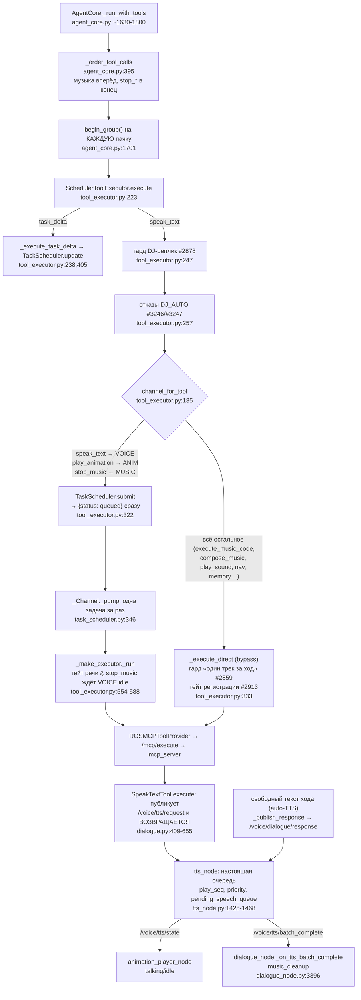
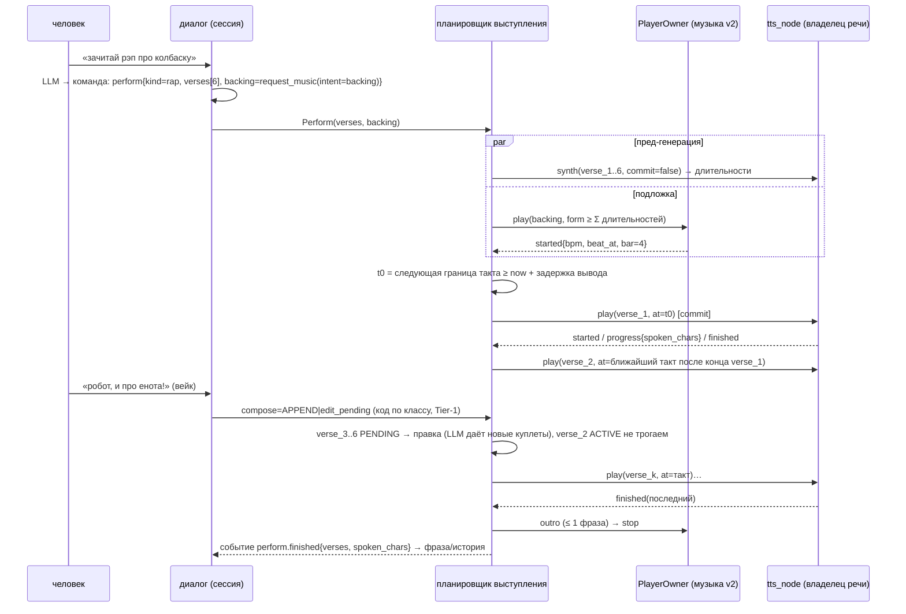

# 07. Планировщик действий: речь, анимация, свет, звук, музыка, движение

> Задача товарища Шифу (02.10.2026): разобрать шедулер. Робот читает рэп про одно, ему в процессе добавляют ещё, и он должен дочитать. Решение «все тулы идут в шедулер» обросло заплатками и потерялось в коде. Нужно, чтобы робот одновременно играл анимацию и говорил, запускал бит и читал рэп.
>
> **Честность (ADR-0018).** Всё ниже собрано чтением кода на `ab112bf5e`, `git log`, issue через REST и первоисточниками. **Робот я не трогал, e2e не гонял, pytest не запускал.** Выводы о поведении на роботе, которые я сделал только по коду, помечены **(по коду)**. Отдельный список непроверенного — §10.

---

## 0. Коротко

1. Планировщик есть (`rob_box_voice/scheduler/`, около 2,5 тыс. строк). В живом пути он делает одно: раскладывает вызовы тулов LLM по трём FIFO-очередям (`voice` / `music` / `anim`) и сразу отвечает LLM `{"status":"queued"}`. Всё остальное (MERGE, ETA, заморозка сегментов, автопродолжение, отмена, события) написано и покрыто тестами, но **ни к чему не подключено** или **выключено флагом** (`barge_in_policy: "replace"` в боевом конфиге).
2. Главная находка **(по коду)**: задача канала `voice` завершается, когда запрос **опубликован** в TTS, а не когда он **прозвучал**. `speak_text` публикует и сразу возвращается (`mcp_tools/tools/dialogue.py:625-645`, `"async": True`), а ожидание `tts/finished` удалено ещё в августе (`register_tts` нигде не вызывается). Поэтому:
   - канал `voice` почти всегда пуст. К приходу «и ещё про енота» все куплеты уже лежат в очереди `tts_node`, и планировщику нечего мёржить. `[SEGMENT PLAN]` пуст, `task_delta` недостижим. Это объясняет живой прогон 29.08: «новая история с нуля» (`docs/e2e/2026-08-29-live-e2e-session-handoff.md:82-90`);
   - «`stop_music` ждёт, пока речь закончится» (`tool_executor.py:583`, `wait_until_idle(VOICE)`) на деле ждёт только публикации. От обрыва бита реально защищает другая заплатка: cleanup по `/voice/tts/batch_complete` в `dialogue_node`.
3. Реальная очередь речи живёт в **`tts_node`**: `play_seq`, приоритет `operator`, отложенная очередь чужих батчей, STOP с окном иммунитета. Это второй планировщик. Первый о нём не знает.
4. «Рэп под бит» работает как набор заплаток, без синхронизации. Музыкальные тулы переставляются в начало пачки (`agent_core.py:395`), бит стартует сразу, речь начинается, когда синтезируется первый чанк, а бит гасится после последнего `batch_complete`, если ход его «вооружил». С тактом речь никак не связана. Квантование по такту есть только внутри музыки (`clock_phase.py`, PlayerOwner v2 за флагом `music_engine: "v1"`).
5. «Дочитай, потом сделай» в бою **невозможно**: фраза с вейком во время речи шлёт STOP (stt_node) и отменяет ход (REPLACE). Режим `classify`, где был путь QUEUE/MERGE, выключен. Это ровно жалоба Шифу из #993 (05.08), и она до сих пор не закрыта по существу.
6. ADR-0150 (proposed) **не описывает планировщик** и в двух местах делает рэп под бит невозможным: речь ограничена 280 символами и **не озвучивается, если в команде есть действия**; любая фраза с вейком отменяет речь. Это надо поправить до PR-7 (§9).

---

## 1. Текущее устройство

### 1.1 Как тул попадает в планировщик

Обёртку собирает `dialogue_node._make_scheduler_executor` (`dialogue_node.py:2204`). События задач уходят в `/harness/task_events` (`_on_task_event`, `dialogue_node.py:2217`). Блоки `[ACTIVE TASKS]` и `[SEGMENT PLAN]` вставляются в системный контекст (`dialogue_node.py:4683-4702`).

### 1.2 Каналы и кто реально исполняет

| Канал планировщика | Тулы | Что значит «задача завершена» | Реальный исполнитель и его очередь |
|---|---|---|---|
| `VOICE` | `speak_text` (`tool_executor.py:82`) | запрос **опубликован** в `/voice/tts/request` **(по коду)** | `tts_node`: синтез в пуле, воспроизведение по `play_seq` в порядке приёма; `priority=operator` встаёт сразу за активным чанком (#1996); чанк чужого батча ждёт `batch_complete` активного (#2553, `tts_node.py:1450-1468`); STOP с окном `IGNORE_STOP_MS` и буфером «после синтеза» (`tts_node.py:1835-1900`) |
| `ANIM` | `play_animation` (`:97`) | опубликовано в `/voice/animation/request` | `animation_player_node`: побеждает последняя запись, ставит флаг ручной анимации, который **сбрасывается на первом `ready` от TTS** (`animation_player_node.py:255-266`); talking/idle переключаются автоматически по `/voice/tts/state` с дебаунсом 0,6 с (`:87-93`, `:228-298`) |
| `MUSIC` | только `stop_music` (`:94`) | после `wait_until_idle(VOICE)` (`:583`), то есть после **публикации** последнего `speak_text` **(по коду)** | `mcp_server` MusicManager |
| bypass | `execute_music_code`, `compose_music`, `set_vibe_preset`, `load_track`, `play_sound`, навигация, память, поиск, `set_voice` и т.д. | реальный результат тула (блокирующе, таймаут 10 с, `executors/ros_mcp.py:48`) | свои ноды. `play_sound` публикует триггер и **сразу отвечает «Звук запущен»** (`tools/sound.py:151`), а `sound_node` молча **пропускает** звук, если играет другой или идёт голосовой стрим оператора (`sound_node.py:221-228`). Приоритеты звуков из PR #1332 не влиты (PR закрыт без мёржа) |

В `tts_node` два входа: `/voice/tts/request` (speak_text, `say` ТАРС, grip супервизора, telegram, stt_node) и `/voice/dialogue/response` (свободный текст хода, `tts_node.py:1247`). Свободный текст в `VOICE` планировщика **не попадает вообще**. В прогоне 29.08 весь куплет пришёл свободным текстом: `tools=[]`.

### 1.3 Что получает LLM

- `speak_text`, `play_animation`, `stop_music` возвращают `{"status":"queued","task_id",...,"deferred_until_voice_drained"}` (`tool_executor.py:318-331`). О том, прозвучало ли, LLM не узнаёт никогда. Счётчики `spoken_texts` / `speak_text_real_count` растут в момент **запроса** (разбор 30.08, §6).
- Bypass-тулы возвращают реальный результат. Музыкальные стартеры вынесли из очереди после party-регрессии 19.08 (`1579d56bf`): «queued» ослеплял DJ-LLM.
- `task_delta` возвращает реальный исход по каждой операции (`tool_executor.py:405-488`).
- Своего события «завершено» для LLM нет. Есть `/harness/task_events` (`task.started/completed/failed/cancelled`), но для `VOICE` это события публикации, а не звучания. Сигнал «вся речь хода прозвучала» — `/voice/tts/batch_complete` от `SpeakTextTool._publish_batch_complete` (`dialogue.py:657-700`). Он ведёт только cleanup музыки.

### 1.4 Новая команда во время речи

| Режим | Что происходит | Где |
|---|---|---|
| **`replace` (бой)**, `docker/vision/config/voice_assistant/dialogue_node.yaml:23` | фраза с вейком: stt_node сразу шлёт STOP в `/voice/tts/control` (`stt_node.py:2035-2045`); допуск зовёт `cancel_inflight(stop_tts=True)` (`stt_admission.py:813-816`), то есть `_cancel_run` отменяет ход и ещё раз шлёт STOP (`dialogue_node.py:9800-9829`). Задачи планировщика **не отменяются**: `TaskScheduler.cancel` (`task_scheduler.py:918`, добавлен в #1995) без вызывающих, а их задачи всё равно уже «выполнены» публикацией | REPLACE всегда |
| `classify` (выключен, только `ros2 param set`) | `quick_decide` (`scheduler/quick_decide.py`): междометия → IGNORE; «хватит/стоп/замолчи/отставить» и музыкальные стопы → REPLACE; остальное → PENDING_LLM. Если ход LLM ещё в полёте, PENDING_LLM встаёт в `_pending_user_messages` (`dialogue_node.py:644`) и уходит одним доп. ходом после текущего. Если хода нет, ход отменяется **без STOP** (`stop_tts=False`) и начинается новый, а старая речь доигрывает в очереди `tts_node` **(по коду; что новая реплика встанет за старой, а не отбросится по `dialogue_id`, не проверено)** | QUEUE существует только пока идёт генерация LLM, а не пока звучит речь |
| без вейка | audio_node с #993 пропускает VAD во время TTS, решает вейк-гейт; фраза без вейка во время речи не адресована | — |

### 1.5 pregenerate и «рэп под бит»

**pregenerate (ADR-0056/0092).** В `tts_node` код живой: `pregenerate()` вызывается на каждом чанке (`tts_node.py:2441-2451`, реализация `:3654`), параметры в YAML с #2421. Но `build_pregen_task` берёт данные из поля `pregenerate` в payload чанка (`scheduler/pregen/pre_gen.py:163`), а **ни один публикатор это поле не заполняет**: grep по `src` вне тестов находит его только в `pre_gen.py`. Итог: подключено, но не получает данных. Кода много, эффект нулевой **(по коду)**.

**Рэп под бит, как он устроен сейчас:**

1. Промпт требует «rap ≥ 6» реплик `speak_text` по ≤ 200 символов (`master_prompt_compact.txt:445-456`) плюс бит через `execute_music_code`/`compose_music`.
2. `_order_tool_calls` ставит музыкальные стартеры в начало пачки (`agent_core.py:189,395-431`). Бит стартует сразу, без ожидания такта; квантует его сам Renardo на `next_bar` (`core/clock_phase.py:7-51`, `arranger.py:106-140`).
3. Каждый `speak_text` режется на чанки и публикуется сразу. Первый звук речи появляется, когда синтезирован первый чанк. **Привязки начала куплета к такту нет**: ни в `speak_text`, ни в `tts_node` нет понятия доли и такта (grep `bar|beat|такт` по `tts_node.py` — 0 совпадений по смыслу).
4. Бит гасится после последнего `batch_complete`, если ход вооружил `_pending_music_cleanup` (`dialogue_node.py:1097`). Не гасится, если идёт ход LLM (заплатка «прелюдия», `:3438-3450`) или если музыка в режиме TRACK (`_track_mode_music_active`, `:1119`, исправление 30.08), а после #3174 ещё и не гасит DJ-сет, запущенный роутером.
5. Различают «просил голос» (рэп разрешает N `speak_text`) и «просил бит без голоса» два разных списка ключевых слов: `_VOCAL_REQUEST_KEYWORDS` (`agent_core.py:526`) и `MUSIC_GUARD_VOCAL_KEYWORDS` (`dialogue_guards.py`). Их нельзя сливать, это проверяет отдельный тест (`agent_core.py:507-524`).
6. В DJ-ходе действует лимит реплик (#2878). #3221 (30.09) — лимит резал пользовательский рэп до одной строки; починено разделением происхождения хода (`TURN_IS_DJ_AUTO`).

### 1.6 Живое, мёртвое, теневое

| Часть | Строки | Статус | Доказательство |
|---|---|---|---|
| `SchedulerToolExecutor` (маршрутизация, `queued`) | `tool_executor.py` 691 | **живое** | `dialogue_node.py:2204-2215` |
| `TaskScheduler` (FIFO-каналы, `submit`, `_pump`, `wait_until_idle`) | `task_scheduler.py` 1312 | **живое**, но канал `VOICE` отслеживает публикацию, а не звук | §1.2 |
| `[ACTIVE TASKS]`, `[SEGMENT PLAN]` в контексте | — | живое, практически всегда пустое **(по коду)**; `eta=?` всегда | нет ETA-провайдера |
| `TaskScheduler.update` + `task_delta` (MERGE) | `update` CC 25 | **живое, но недостижимое**: нет PENDING-сегментов (§0 п.2); группа заводится на каждую пачку (`agent_core.py:1701`) | live 29.08: MERGE «не настоящий» |
| `TaskDeltaTool` в mcp_server | `mcp_tools/tools/scheduler.py` 177 | только схема для LLM; `execute` в проде честно возвращает ошибку | docstring `:1-19` |
| скилл `scheduler` | `prompts/skills/scheduler.txt` | описывает `task_delta` как «продлить, сократить, отменить», а в коде операции rewrite/replace/append/drop — **описание расходится с кодом** | файл целиком |
| `TaskScheduler.cancel` (C2, #1995) | `:918-980` | **мёртвое**: вне тестов вызовов нет | grep `scheduler.cancel` = 0 |
| `set_llm_continue_hook`, `notify_event`, `set_eta_provider`, `set_group_boundary`, `set_frozen_touch_hook` | `:797-830, 1009, 1077, 1292` | **мёртвое** (хуки без подключения) | grep вне `scheduler/` = 0 |
| `quick_decide` + `barge_in_policy=classify` + `_pending_user_messages` | `quick_decide.py` 137 | **спит за флагом**, в бою `replace`. Сама функция живая, импортируется из `stt_admission_host.py:36` | `dialogue_node.yaml:23` |
| `scheduler_shadow.shadow_quick_verdict` (#3084) | `harness/decision/scheduler_shadow.py` 64 | **теневое без вызывающих**: PoC, вне тестов не вызывается | grep = 0 |
| `scheduler/pregen/*` в `tts_node` | ~1395 | **подключено, не получает данных** (нет поля `pregenerate`) | §1.5 |
| EventBus, ReflexLayer, EventBus-мост | — | **удалены** 09.09 (ADR-0083/0086, `bd4d608b9`, `31fac3e16`) | — |
| `action_server` (ADR-0011) + сайдкар `voice-action-server` | `action_server/` 4 модуля | **зомби**: контейнер описан (`docker/vision/docker-compose.yaml:448-460`) и запускается, обработчик — заглушка `_handler` (`action_server/http_server.py:12-15`), клиентов нет (grep `8765`/`PastePlanner` вне пакета = 0). ADR-0150 PR-0 уже числит его мёртвым (D15) | — |
| `EffectAwaiterRegistry.register_tts` | `core/speak_helpers.py:663` | **мёртвое**: вызовов нет; `git log -G "\.register_tts\("` по продакшн-путям пуст | — |
| `_order_tool_calls` → `deferred_call_ids` | `agent_core.py:426-431` | вычисляется и **выбрасывается** (`execution_order, _deferred`, `:1712`); `stop_navigation` в исполнителе не откладывается (там только `stop_music`) | — |

### 1.7 Заплатки, которые наросли на исполнителе и вокруг

Без ADR-0148 заплатки стекаются в одну точку. `SchedulerToolExecutor.execute` за шесть недель стал свалкой гардов:

| Заплатка | Где | Issue |
|---|---|---|
| музыкальные стартеры вынесены из очереди | `tool_executor.py:84-94` | party 19.08 |
| «один трек за ход» | `_execute_direct`, `track_start_guard.py` | #2859 |
| лимит и обрезка DJ-реплик | `_apply_dj_speak_guard` | #2878, #3221 |
| отказы DJ_AUTO (`stop_music`, перезапуск сета) | `:250-268` | #3246, #3247 |
| гейт речи до исхода регистрации | `_make_executor`, `turn_speech_gate.py` | #2913 |
| `stop_music` ждёт опустошения VOICE | `:575-584` | #968 v36 |
| fail-open, потом fail-loud | `_ensure_scheduler` | #1995 C3 |
| cleanup музыки по `batch_complete`, учёт батчей, отсрочка при живом ходе, флаг TRACK | `dialogue_node.py:1085-1120, 3396-3460` | #980, #992, «прелюдия 09:09», 30.08, #3174 |
| перестановка тулов в пачке | `agent_core.py:395` | W7a |
| отложенная очередь чужих батчей в TTS | `tts_node.py:1450-1468` | #2553 |
| два списка «голосовых» слов | `agent_core.py:526`, `dialogue_guards.py` | #1708, #992 |
| ручная анимация до первого `ready` | `animation_player_node.py:255-266` | — |

План W7d (`W7_INTEGRATION_PLAN.md:200-214`: «снять `_pending_music_cleanup`, cleanup делает планировщик») **не выполнен**. Вместо снятия костылей поверх добавились ещё четыре.

---

## 2. Хронология решений и потерь

| Дата | Событие | Что решили или сломали | Ссылка |
|---|---|---|---|
| 30–31.07 | рэп «про Федота» в e2e: LLM падает, бит не гаснет / гаснет посреди | костыли: таймер 3 с, отложенный cleanup, перепланирование 5→15 с | #933, #935, #942; `3a0a6961e`, `b25774fe8`, `f905458a7` |
| 31.07 | хотят арранжировку бита под длину рэпа | нет длительности TTS и нет синхронного `speak_text` | #949 |
| **01.08** | **#968**: «LLM вызывает инструменты как пулемёт… некому сказать: сначала доиграй фразу» | сегменты, каналы, MERGE/REPLACE/QUEUE/IGNORE/CLARIFY, события-источники (батарея), feedback | #968 |
| 02.08 | «Итоговая модель» в #968: тулы мгновенно, планировщик владеет каналами, LLM видит состояние, правка = MERGE PENDING | «блокировать не LLM, а исполнение на железе» | коммент. 02.08 17:53, 17:59 |
| 03–04.08 | SCHEDULER_DESIGN v1–v5. v5: одна LLM без «уровня 2», fade-out не нужен, «направо во время песни — параллельно» | — | `SCHEDULER_DESIGN.md` |
| **04.08** | фазы 1–4 **за один день как библиотека**: TaskScheduler, AcceptanceGate, EventBus, Reflex, Speculative, ActionServer+PASTE (ADR-0011) | «приземлено» значило «модуль существует» | `83947d0fc`, `e5e4eec24`, `138a8f6d5`, `d7356b20f`, `3226e5062` |
| 04.08 | `/voice/tts/batch_complete` — честный сигнал «весь батч прозвучал» | лечит обрыв бита на 1-м чанке | #980, `448cab73e`; #992 |
| 05.08 | #993: «в момент зачтения рэпа говорю, чтоб он ещё и музыку добавил — но он не реагирует» | VAD-гейт снят; дальше REPLACE на вейке | #993 |
| 13.08 | W7: `SchedulerToolExecutor` подключён к `dialogue_node`. PR #1180/#1209 смёржены **без e2e** (комм. merge-gate) | все тулы «через шедулер» и `queued` | `fc7fc98f7` |
| **19.08** | party-регрессия: `queued` ослепил DJ, **музыкальные стартеры выведены из планировщика** | «все тулы через шедулер» перестало быть правдой | `1579d56bf`, ADR-0033 |
| 28–29.08 | волна segments-merge: `group_id`, `update`, `task_delta`, `quick_decide`, `classify`, очередь фраз (S7), `llm_continue_hook` (S10), FROZEN | живой прогон 29.08: GATE-1 PASS, но MERGE «не настоящий» — новая история с нуля | `04ebf1ae4`…`60c093613`; #1734 |
| 30.08 | разбор: подключены 4 из 13 модулей; `GROUP_ID` не печатался (починено), хуки не заведены, `queued` скрывает исход | — | `docs/plans/2026-08-30-scheduler-integration-review.md` |
| 05.09 | статус в дизайне: «подключены три куска из семи», «стой! через него не работает» | — | `SCHEDULER_DESIGN.md` §0.0 |
| 07.09 | отмена RUNNING-задачи (#1995) и приоритет в TTS (#1996) | отмену так никто и не вызывает | `789892bc6`, `a090c30e2` |
| **09.09** | ADR-0083/0086: EventBus и Reflex **удалить, не подключать**; «мёртвая половина» удалена | события-источники (батарея в песне) потеряны вместе с шиной | `bd4d608b9`, `31fac3e16` |
| 14.09 | ADR-0092: публичный контракт pregenerate | публикатора поля нет до сих пор | `0157f083e` |
| 15.09 | 14 STOP за 30 мин на DJ-сете → отложенная очередь чужих батчей в `tts_node` | второй планировщик растёт внутри TTS | #2553 |
| 23.09–01.10 | гарды в исполнителе: #2859, #2878, #2913, #3221, #3246/#3247 | исполнитель превратился в свалку правил | §1.7 |
| 01.10 | музыка v2: PlayerOwner, старт на такте, события `started`/`rejected` | флаг `music_engine: "v1"` в бою | `96ff9e38a`, ADR-0149 |
| 02.10 | ADR-0150 (proposed): сессия, команда, событие | раздела про планировщик нет; правило «речь не озвучивается при действиях» исключает рэп под бит | §9 |

**Что потеряли по дороге:**
- **(а)** блокировку «речь до `tts/finished`» убрали, а замену («блокировка переезжает внутрь voice-канала», `SCHEDULER_DESIGN.md` §3.3) не сделали. Канал отслеживает публикацию;
- **(б)** «все тулы через шедулер»: 19.08 музыка ушла в bypass;
- **(в)** события-источники: EventBus удалён;
- **(г)** QUEUE «а потом спой колыбельную»: не сделано, и S7 его не закрывает;
- **(д)** прогноз длительности (ETA) и пред-генерация: подключены, но данных не получают.

---

## 3. Каталог хотелок Шифу

| # | Хотелка (коротко) | Источник | Статус |
|---|---|---|---|
| Х1 | Читать рэп под бит: бит — подложка, гаснет после речи | #935 (30.07), #980 (04.08), #3221 (30.09: «ожидание: робот зачитывает рэп целиком, бит… гаснет после речи») | **работает частично**: старт и гашение есть на заплатках, гашение хрупкое (#3174) |
| Х2 | Начинать читать с начала такта, арранжировка под длину рэпа | #949 (31.07), ADR-0149 I9 (старт музыки на такте) | **не сделано** для речи |
| Х3 | Во время рэпа догрузить («ещё и музыку добавь», «и про енота») — дочитать и вплести | #993 (05.08): «в момент зачтения рэпа говорю чтоб он ещё и музыку добавил — но он не реагирует»; #968 (01.08) «комар + енот» | **сломано**: в бою REPLACE; MERGE недостижим (§0 п.2) |
| Х4 | «А потом спой колыбельную» — QUEUE после текущего | #968, таблица решений | **не сделано** |
| Х5 | «Хватит, анекдот» — допеть фразу, потом новое (REPLACE на границе) | #968, «Естественные границы» | **не сделано**: STOP мгновенный, граница предложения не соблюдается |
| Х6 | `stop_music` не режет речь | #968 v36 | **работает на другой заплатке** (cleanup по `batch_complete`); деферрал планировщика холостой **(по коду)** |
| Х7 | Анимация одновременно с речью | #968 табл. каналов: «анимация может идти параллельно с любым каналом»; промпт «Animations do NOT block speech» | **работает частично**: talking авто; эмоция с `speak_text` перетирается на 1-м `ready`; `play_animation` — последняя запись побеждает |
| Х8 | Свет (кольцо) живёт вместе с речью/стадиями | ADR-0150 §5.5 (В5) | **не сделано** (рефлексы — план PR-3b) |
| Х9 | Звук-эффект поверх речи | промпт: «speak_text + play_animation + play_sound in ONE iteration» | **работает с враньём**: звук молча пропускается, если занят, а тул отвечает «Звук запущен» |
| Х10 | Батарея/события вплетаются в песню | #968, «Источники событий» | **не сделано**, шина удалена |
| Х11 | «Стой» гасит всё сразу; «направо» во время песни — параллельно | #968 коммент. 03.08 (reflex), SCHEDULER_DESIGN v5 Q5 | «стой»: **работает** (STOP TTS + отмена хода + роутер); «направо» с вейком **рвёт песню** (REPLACE), что противоречит решению Q5 **(по коду)** |
| Х12 | LLM видит, что звучит, что в очереди, ETA | #968, «Feedback events» | **номинально**: блок есть, VOICE пуст, `eta=?` |
| Х13 | Не молчать, пока LLM думает над длинным: «выдал быстро → играет» | #968 INSIGHT #11; #2003 | **не сделано**: pregen не получает данных |
| Х14 | Операторская врезка после текущего чанка, без обрыва | #1996 (05.09) | **в коде есть** (`priority=operator`), живьём мной не проверено |
| Х15 | DJ-фразы не обрывают друг друга | #2553 (15.09) | **сделано** в `tts_node` |

---

## 4. Классы действий по ресурсам

### 4.1 Ресурсы и владельцы

| Ресурс | Владелец сегодня | Событие владельца сегодня | Тулы и писатели |
|---|---|---|---|
| **Голос** (речь в динамик) | `tts_node` | `/voice/tts/state` (строки), `/voice/tts/finished` по чанку, `batch_complete` (публикует mcp_server, не tts_node) | `speak_text`, свободный текст, `say`, grip, telegram, stt_node |
| **Лицо** (матрица) | `animation_player_node` | нет | `play_animation`, `speak_text(animation=)`, авто по TTS-state |
| **Кольцо LED** | `led_node` | нет | слушает `/voice/dialogue/state`, `/audio/direction`, `/voice/animation/request` (ADR-0150 §5.5) |
| **Звуковые эффекты** | `sound_node` | `/voice/sound/state` (частично) | `play_sound`, boop stt_node, thinking dialogue_node, health_monitor |
| **Музыка** | mcp_server: MusicManager v1 / PlayerOwner v2 | v2: `/voice/music/event started/rejected`, latched `/voice/music/state` | `execute_music_code`, `compose_music`, `set_dj_mode`, роутер медиакоманд |
| **Движение** | Nav2, command_node | Nav2 action result | `navigate_*`, `move_direction`, `stop_navigation`, рефлексы command_node |
| **Внешнее** (telegram, память, поиск, время) | свои ноды и сервисы | ответ тула | `memory_*`, `search_web`, `get_*` |
| **Общий выход** аудио 16 кГц ReSpeaker | никто | — | голос + музыка + эффекты; ducking музыки под речь отсутствует (grep `duck` в голосовом стеке = 0) |

### 4.2 Матрица совместимости «что с чем можно одновременно»

Обозначения: ✅ — можно параллельно; ⏭ — после текущего (APPEND); ⟳ — заменить на границе (REPLACE); ⚠ — сегодня работает с дефектом; ✖ — нельзя.

**Как сейчас (по коду):**

| новое ↓ \ занято → | голос | лицо | LED | SFX | музыка | движение |
|---|---|---|---|---|---|---|
| **голос** | ⏭ FIFO в tts_node; на вейке ⟳ мгновенно | ✅ | ✅ | ✅ | ✅ без такта | ✅ |
| **лицо** | ⚠ ручная анимация до 1-го `ready`, дальше talking | ⚠ последняя запись побеждает | ✅ | ✅ | ✅ | ✅ |
| **SFX** | ✅ (микс) | ✅ | ✅ | ⚠ новый **молча пропущен** | ✅ | ✅ |
| **музыка (старт)** | ✅ стартует до речи (перестановка) | ✅ | ✅ | ✅ | ⟳ `Clock.clear` / v2 одна дека; лимит «1 трек за ход» | ✅ |
| **stop_music** | ⚠ деферрал холостой, защищает cleanup | — | — | — | ⟳ сразу | — |
| **движение** | ✅ | ✅ | ✅ | ✅ | ✅ | ⟳ (Nav2 вытесняет) |

**Как должно быть (предложение для v2):**

| новое ↓ \ занято → | голос (реплика) | голос (выступление) | лицо | LED | SFX | музыка (подложка выступления) | музыка (трек/сет) | движение |
|---|---|---|---|---|---|---|---|---|
| **реплика** | ⏭ | ⏭ дочитать; ⟳ на границе предложения только по Tier-1 «хватит/стоп» | ✅ | ✅ | ✅ | ✅ | ✅ (ducking) | ✅ |
| **выступление** | ⏭ | ⏭ по умолчанию; MERGE в PENDING-куплеты, если LLM явно правит текущее | ✅ | ✅ | ✅ | — | ⟳ подложка вытесняет трек на такте **или** ✖ с фразой «сначала выключить трек?» — решение Шифу | ✅ |
| **экспрессия** (эмоция/жест) | ✅ MERGE с TTL, рефлекс `speaking` — слой под ней | ✅ | MERGE | MERGE | ✅ | ✅ | ✅ | ✅ |
| **SFX** | ✅ | ✅ | ✅ | ✅ | ⏭ или вытеснение по приоритету (событие `skipped{busy}`, не враньё) | ✅ | ✅ | ✅ |
| **музыка (старт)** | ✅ | ⟳ смена подложки на такте, речь продолжается | ✅ | ✅ | ✅ | ⟳ на такте | ⟳ на фразе (ADR-0149) | ✅ |
| **движение** | ✅ | ✅ | ✅ | ✅ | ✅ | ✅ | ✅ | ⟳ (preempt Nav2) |
| **«стой»** | ⟳ сразу всё: речь, движение; музыка — `dj_set(stop)` по снимку (ADR-0150 §6.2) |||||||
| **query** (поиск, память) | ✅ параллельно, отменяется при перебивании | ✅ | ✅ | ✅ | ✅ | ✅ | ✅ | ✅ |

Ключевое отличие: **«выступление»** (песня, рэп, сказка, стих) становится отдельным классом действия с собственным ресурсом. Это не N независимых реплик.

---

## 5. Политики при новой команде во время исполнения

### 5.1 Четыре политики (словарь BML)

| Политика | Смысл | Когда | Граница |
|---|---|---|---|
| **APPEND** (QUEUE) | начать после конца текущего блока | новая реплика или выступление во время речи — **по умолчанию**; «а потом…» | конец блока |
| **MERGE** | исполнять вместе; не трогать начатое, править только ещё не начатое | экспрессия поверх речи; движение поверх песни; правка PENDING-куплетов («и про енота») | сразу; для правки — ближайший PENDING-сегмент |
| **REPLACE** | закончить текущее и начать новое | Tier-1 «хватит/стоп/замолчи»; смена подложки | голос — конец предложения (≤ 3 с), музыка — такт; «стой» — сразу |
| **REJECT** | не исполнять, честно сказать почему | конфликт ресурса без права вытеснения (навигация непрерываема, ADR-0150 §5.1); тишина | — |

### 5.2 Кто решает

Сегодня решают три разных механизма без общей таблицы:
- stt_node шлёт STOP на любой вейк;
- `quick_decide` — регекс-правила (выключен);
- LLM через `task_delta` (недостижим).

Предложение в духе ADR-0148:
1. **Код по классу действия** задаёт политику по умолчанию. Таблица `knowledge.COMPOSITION[(новый класс, занятый класс)]` — данные, одна на проект.
2. **Tier-1 грамматика** (`grammar.py`, ADR-0150 §4.2) переопределяет по закрытому списку: «стоп/хватит» → REPLACE; «потом/после/когда закончишь» → APPEND; «сейчас/прямо сейчас» → REPLACE на границе.
3. **LLM** может выбрать только из перечисления в команде (`when ∈ {after_current, now}`; для выступления ещё `edit_pending`). Валидатор отклоняет `now` для непрерываемых классов. Свободного «решения о прерывании» у LLM нет.
4. **Фразу** о том, что произошло («Дочитаю и включу», «Поставлю после куплета»), строит код по событию `queued{position}`, а не LLM.

---

## 6. Паттерны из опенсорса

| Источник | Что там есть | Что перенять | Проверено |
|---|---|---|---|
| **BML 1.0** (стандарт, 46 стр., [PDF](https://projects.cs.ru.is/attachments/download/843/bml-standard-1.pdf)) | блок `<bml>` с атрибутом `composition`: **MERGE** (по умолчанию; в конфликте новый блок «cannot modify behaviors defined by prior blocks», конфликтующее поведение нового блока отбрасывается с warning), **APPEND** («as soon as possible after the end time of all prior blocks»), **REPLACE** (всё прежнее завершается, нейтральная поза). Точки синхронизации start/ready/stroke-start/stroke/stroke-end/relax/end; `<sync id>` внутри текста речи; `<constraint><synchronize>` связывает `speech1:sync4` с `beat1:stroke:2`. `<required>`: если нельзя исполнить, блок целиком отменяется с warning. Обратная связь: `blockProgress` (start/end обязательны), `syncPointProgress`, `predictionFeedback` (прогноз времени с правом пересмотра), warning | (1) словарь политик §5.1; (2) **точки синхронизации** как модель «куплет начинается на такте»: `speech:verse_i:start ↔ music:bar_n`; (3) `required` для выступления: подложка не стартовала → не начинаем рэп «в тишину», честное событие; (4) `predictionFeedback` = ETA из пред-генерации; (5) `blockProgress` — события выступления | **да**, текст стандарта прочитан |
| **ROS 2 actions** ([design](https://design.ros2.org/articles/actions.html)) | goal принимается или отклоняется синхронно; состояния ACCEPTED/EXECUTING/CANCELING/SUCCEEDED/ABORTED/CANCELED; feedback-топик; cancel по id, по времени или все. Политика вытеснения — **дело сервера**: «it is up to the server to decide how goals from multiple clients will be handled» | выступление как «goal»: `accepted/rejected` сразу, `feedback{verse, spoken_chars}`, `result`; вытеснение — политика владельца ресурса, не клиента | **да** |
| **Nav2 SimpleActionServer** ([API](https://api.nav2.org/nav2-jazzy/html/classnav2__util_1_1SimpleActionServer.html)) | `is_preempt_requested()`, `accept_pending_goal()`: новая цель ждёт, а текущая сама решает, когда отпустить | REPLACE на границе: владелец речи проверяет «есть ожидающая цель» на границе предложения или такта | по поисковой выдаче, страницу не открывал целиком |
| **BehaviorTree.CPP** ([Parallel](https://www.behaviortree.dev/docs/nodes-library/ParallelNode)) | `Parallel`: завершается по порогу success/failure, «Any remaining running children are halted»; `ParallelAll` доводит всех до конца | выступление с подложкой = `Parallel(success_count=1)` над `[речь, музыка]`: речь закончилась → подложка останавливается (outro). Это заменяет `_pending_music_cleanup` и флаг TRACK | **да** |
| **Pipecat** ([function calling](https://docs.pipecat.ai/pipecat/learn/function-calling)) | `cancel_on_interruption` (по умолчанию True): при перебивании вызов отменяется; False — асинхронно, результат приходит позже как developer message и запускает новый ход; бот может говорить, пока функция выполняется | флаг прерываемости в `ACTION_CLASSES` (ADR-0150 уже ссылается); поздний результат = событие в сессию, а не `queued` | **да** |
| **LiveKit Agents** ([speech](https://docs.livekit.io/agents/build/speech/)) | `session.say(..., allow_interruptions=False)`; `SpeechHandle.wait_for_playout()`; `add_done_callback` срабатывает и при перебивании | ручка речи с исходом `finished/interrupted{spoken_chars}` — ровно то, чего нет у `speak_text` | по выдаче поиска; страницу целиком не читал |
| **Furhat** ([speech](https://docs.furhat.io/speech/)) | `furhat.say` блокирует по умолчанию, `async=true` — нет; utterance смешивает текст и `Gestures.*` внутри | экспрессия внутри реплики (жест на слове), а не отдельный тул «перед/после» | по выдаче поиска |
| **NAOqi ALAnimatedSpeech** ([2.5](http://doc.aldebaran.com/2-5/naoqi/audio/alanimatedspeech.html)) | аннотированный текст: `^start(anim)` запускает анимацию параллельно речи; `bodyLanguageMode` disabled/random/contextual — жесты заполняют неаннотированный текст автоматически | рефлекс `speaking` + опциональные метки в тексте выступления | `^start` и `bodyLanguageMode` — по выдаче; семантика `^wait`/`^run` (блокирует ли речь) — **не подтверждено**, страница не открылась |
| **Ableton Link** ([docs](https://ableton.github.io/link/)) | `quantum` — «the desired unit of phase synchronization»; **quantized launch**: старт на следующей границе кванта | старт куплета на следующей границе такта (quantum = 4 доли) по часам музыки | **да** |
| Misty, py_trees | — | — | **не открывал** |

---

## 7. Синхронизация «рэп на бит с начала такта» — как это может работать

Нужные кирпичи и где они уже есть:
- часы музыки и квантование: `clock_phase.py`, `arranger.py` («next_bar = k·F», #3112), PlayerOwner `started` со снимком фазы (`engine/player_owner.py:78-95`);
- длительность речи до звучания: пред-генерация (`scheduler/pregen`, ADR-0092) плюс `estimate_tts_duration`;
- задержка вывода звука: мерить `jack_rec` (память «Аудит записей с робота»), а не угадывать;
- старт чанка в момент времени: **в `tts_node` нет** «играть в t». Это новая возможность владельца речи.

Метрика приёмки: смещение начала каждого куплета от доли такта по записи `jack_rec` (`audit_wav.py` уже умеет сетку 16-х), порог задаёт Шифу.

---

## 8. Требования к планировщику в dialog v2

В духе ADR-0148: решает код, состояние — у владельца, фраза строится из события.

| # | Требование | Хотелки / баги | Что удаляется |
|---|---|---|---|
| **П1** | **Выступление — класс действия** `action.perform{kind, verses[], backing?}`. LLM отдаёт куплеты **списком в одной команде**, а не N вызовами `speak_text` за N итераций. Сегменты режет код | Х1, Х3; #2878, #3221; разбор 30.08 §5 («группа на каждую пачку»); INSIGHT #5 | правило промпта «rap ≥ 6 speak_text», лимит DJ-реплик для пользовательских ходов |
| **П2** | **Статус сегмента приходит от владельца ресурса, не от публикации.** У голоса — `SpeechEvent` (queued/started/progress/finished/cancelled{spoken_chars}, ADR-0150 §6.1); у лица, кольца, SFX — `ExpressionEvent started/skipped{reason}`; у музыки — `started/rejected/finished`; у движения — результат Nav2 | Х6, Х9, Х12; §0 п.2; `sound_node.py:226` | `{"status":"queued"}`, `wait_until_idle` с опросом 20 мс, `batch_registered/batch_complete` из mcp_server |
| **П3** | **Одна таблица ресурсов и совместимости** в `knowledge` (`RESOURCE_OF[класс]`, `COMPOSITION[(новый, занятый)]`, §4.2). Тест проверяет поведение планировщика, а не текст промпта | Х7, Х9, Х11 | `_VOICE_TOOLS/_MUSIC_TOOLS/_ANIM_TOOLS` (`tool_executor.py:82-103`), `_MUSIC_PRELUDE_TOOLS/_DEFER_TO_END_TOOLS` (`agent_core.py:189-203`), два списка «голосовых» слов |
| **П4** | **Политику (APPEND/MERGE/REPLACE/REJECT) выбирает код** по таблице П3. Tier-1 грамматика переопределяет по закрытому списку. LLM выбирает только `when ∈ {after_current, now}`, валидатор отклоняет недопустимое. **По умолчанию речь во время речи — APPEND (дочитать)** | Х3, Х4, Х5; #993 | STOP из stt_node на любой вейк (`stt_node.py:2035-2045`), `barge_in_policy` и обе ветки, `quick_decide` (если Tier-1 его покрывает) |
| **П5** | **REPLACE на естественной границе**: голос — конец предложения, при этом не позже N с; музыка — такт. «Стой» — сразу. Граница — событие владельца (`is_preempt_requested`-модель Nav2) | Х5, Х11; #968 «Естественные границы» | `IGNORE_STOP_MS`, буфер «STOP после синтеза» (`tts_node.py:1868-1900`) |
| **П6** | **MERGE правит только PENDING-сегменты выступления.** ACTIVE не трогается. Правка — новая команда LLM с `edit_pending`, применяет код. Блок для LLM: что звучит, какие куплеты ещё впереди, сколько секунд осталось (из П7) | Х3, Х12; ADR-0033 | `task_delta` (тул, схема в mcp_server, скилл `scheduler.txt`), `[SEGMENT PLAN]` с `GROUP_ID`, хуки FROZEN/boundary |
| **П7** | **Пред-генерация выступления**: все куплеты синтезируются заранее без побочных эффектов, `commit` при воспроизведении (контракт ADR-0011 §3.6 / ADR-0092). Длительности дают ETA и раскладку по тактам | Х2, Х13; #2003, #949 | неподключённое поле `pregenerate` или подключить его здесь — одна реализация |
| **П8** | **Синхронизация с битом**: начало каждого куплета — на ближайшей границе такта подложки, по `started{bpm, beat_at}` и с измеренной задержкой вывода (BML `synchronize`, Link quantized launch). Владелец речи получает «играть в момент t» | Х2; #949; ADR-0149 I9 | — |
| **П9** | **Время жизни подложки = время выступления** (`Parallel(success_count=1)` BT): речь кончилась → outro подложки на фразе → стоп; подложка не стартовала → выступление `required`-отказ с фразой из шаблона, а не рэп в тишину | Х1, Х6; #980, #992, #3174 | `_pending_music_cleanup`, `_active_batches`, отсрочка при живом ходе, `_track_mode_music_active` (`dialogue_node.py:1085-1120, 3396-3460`), `/mcp/music_cleanup`, Bug C-вердикты по рэпу |
| **П10** | **Фраза об исполнении и история — из событий.** В историю пишется `text[:spoken_chars]`; «Дочитаю и включу» — шаблон по `queued{after}`; LLM не говорит «Зачитал!» до `perform.finished` | Х12; #968 INSIGHT #8 (постамбл); разбор 30.08 §6 | постамбл-гарды, `speak_text_real_count` как признак «сказано» |
| **П11** | **Прерываемость — свойство класса** (`cancel_on_interruption`): query отменяется, motion и identity — нет, выступление — на границе; отмена по эпохе (ADR-0150 §6.2) | Х11 | `TaskScheduler.cancel` без вызывающих — либо подключить как реализацию, либо удалить |
| **П12** | **Внешние события** (батарея, телеграм, таймер) входят в ту же сессию событием с приоритетом и могут добавить сегмент на границе (APPEND в выступление). Отдельный виток после П1–П11 | Х10; #968 «батарея» | — |
| **П13** | **Наблюдаемость в стиле BML feedback**: `/dialog/plan_event` (block start/end, сегмент started/finished, прогноз), метрики: смещение куплета от такта (мс), задержка до тишины после «стой», доля APPEND против REPLACE | все; #968 «Feedback events» | `/harness/task_events` в нынешнем виде |
| **П14** | **Гарды уходят из исполнителя в правила класса.** «Один трек за ход», лимиты DJ, гейт регистрации — поля `ACTION_CLASSES` или проверки валидатора команды. Исполнитель только исполняет | §1.7 | ветки `_apply_dj_speak_guard`, `dj_auto_refusal_content`, `TrackStartGuard` в `SchedulerToolExecutor` |
| **П15** | **Удалить мёртвое с grep-доказательством в том же PR, где появляется замена** (память «Не держать две реализации»): `scheduler_shadow.py`, хуки `TaskScheduler` без вызовов, `action_server` + сайдкар `voice-action-server`, `register_tts`, `deferred_call_ids`, `TaskDeltaTool`, `skills/scheduler.txt` | — | см. столбец |

---

## 9. Что поправить в ADR-0150 до PR-7

1. **§4.1, «правило речи при действиях»** (речь не озвучивается, если `actions` непустой) и лимит `speech ≤ 280` исключают рэп под бит: это действие (`request_music(intent=backing)`) плюс длинная речь. Нужен класс `action.perform` (П1). Его «речь» — содержимое выступления, а не отчёт об исполнении, поэтому правило честности на него не распространяется. Фраза «Включаю бит» по-прежнему из шаблона по `started`.
2. **§6.2**: «фраза с вейком во время речи → `SpeechCancel(epoch)`» — это REPLACE всегда, то есть «дочитай» (Х3/Х4) невозможно. Нужна строка для выступления: APPEND по умолчанию, REPLACE только по Tier-1 (П4).
3. **§5.2**: «одна `SpeechRequest` на ход» — для выступления нужна последовательность сегментов с моментами старта (П8).
4. **§3 «17–18 порядок/очередь тулов»** — «`_order_tool_calls` переносится». Предлагаю заменить на таблицу `COMPOSITION` (П3), иначе перенесётся и холостой `_deferred`.
5. В таблице владельцев (§3) нет **планировщика выступления** как владельца ресурса «выступление». Варианты: модуль в `rob_box_dialog` поверх `SpeechEvent` и `music/event` или часть `tts_node`. Решение — за Шифу.

---

## 10. Что не проверено

- **Поведение на роботе не проверялось.** Утверждения «канал VOICE пуст к приходу второй фразы», «деферрал `stop_music` холостой», «`[SEGMENT PLAN]` практически всегда пуст» выведены из кода (`dialogue.py:625-645`, `tool_executor.py:575-584`, `task_scheduler.py:1268-1287`). Проверка: `ros2 topic echo /harness/task_events` на одном «зачитай рэп» плюс сравнение времени `task.completed` для `speak_text` с `/voice/tts/finished`.
- В режиме `classify`, когда хода нет: встаёт ли новая реплика за старой в `tts_node` или отбрасывается по смене `dialogue_id`. Не проверено.
- `priority=operator` (#1996) и отложенная очередь (#2553) живьём не смотрел; исхожу из кода и закрытых issue.
- Что `led_node` слушает `/voice/animation/request` — взято из ADR-0150 §5.5, код `led_node` не открывал.
- Первоисточники: NAOqi `^wait`/`^run`, страницы Nav2, LiveKit и Furhat целиком не открывал (данные из выдачи поиска); Misty и py_trees не открывал.
- pytest по `scheduler/` не запускал; «мёртвое» определено grep'ом вне каталогов `test`, динамические вызовы через `getattr` по строке я мог пропустить (для `begin_group` такой вызов есть и учтён).
- Не измерено, сколько итераций тул-цикла и групп даёт реальный рэп (разбор 30.08 §7bis предлагал замер — данных в репо не нашёл).
